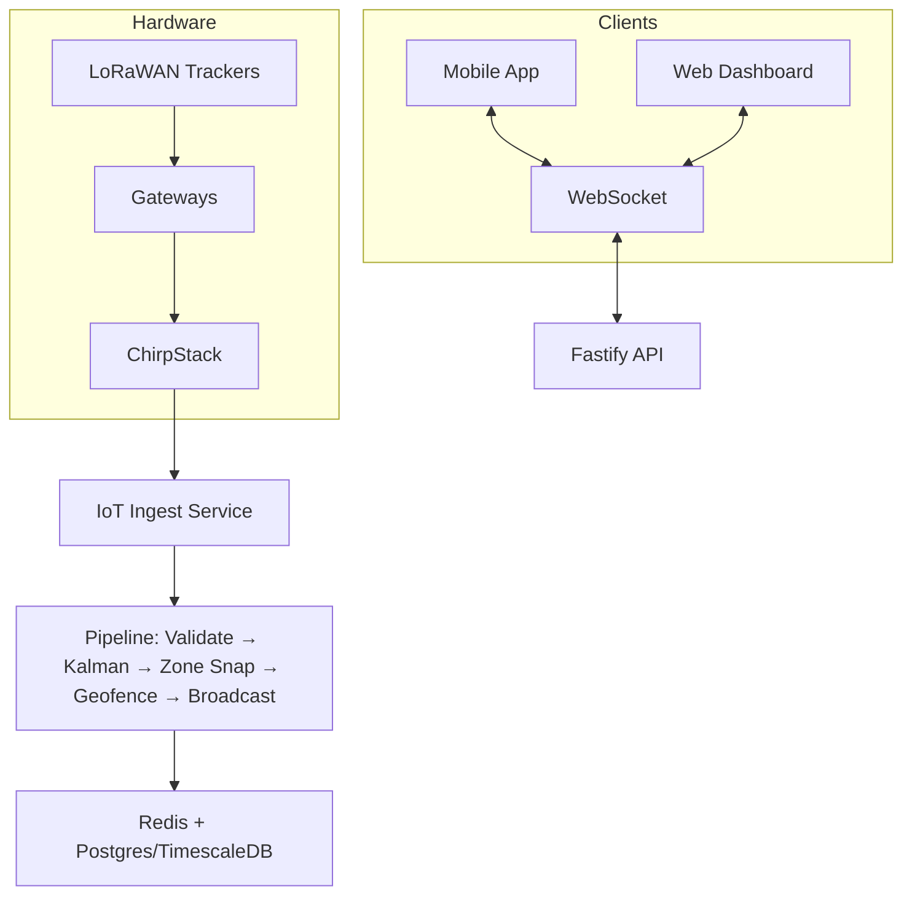

# RV Trax API Endpoint Catalog

**Real-time RV Lot Tracking System**

Base URL: `https://api.rvtrax.com/api/v1`

All endpoints (except public auth) require `Authorization: Bearer <jwt>` or API key. Multi-tenancy is enforced via `dealership_id` from JWT.

**Authentication**: JWT (15min access + 7day refresh tokens). RBAC roles: owner, manager, sales, service, porter, viewer.

**Pagination**: Cursor-based (`?limit=50&cursor=...`). Responses include `data` + `pagination` object.

**Error Format**:

```json
{
  "error": {
    "code": "VALIDATION_ERROR",
    "message": "Invalid input",
    "details": {...},
    "request_id": "req_..."
  }
}
```

**Core Features Documented Here**: Units, trackers, lots, geo-fencing, alerts, staging, location history, work orders.

---

## Architecture Overview



---

## Key Endpoints

### Auth

- `POST /auth/login` - JWT login
- `POST /auth/refresh` - Rotate tokens
- `POST /auth/logout` - Invalidate refresh token

### Units & Inventory

- `POST/GET/PATCH/DELETE /units` - CRUD + search/filter
- `GET /units/:id/location-history` - Timeline
- `POST /units/import` - CSV bulk import

### Trackers

- `POST/GET /trackers` - Manage devices
- `POST /trackers/:id/assign` - Link to unit
- `POST /trackers/:id/unassign`

### Lots & Mapping

- `POST/GET /lots` - Lot management
- `POST /lots/:id/grid` - Define row/spot grid
- `GET /lots/:id/live-positions` - Current locations

### Geo-fencing & Alerts

- `POST/GET /geofences` - Define zones/boundaries
- `POST/GET /alert-rules` - Configurable rules
- `GET /alerts` - List + acknowledge

### Staging & Operations

- `POST/GET /staging-plans` - Lot organization plans
- `GET /staging-plans/:id/move-list` - Porter tasks
- `POST/GET /work-orders` - Service workflows
- `POST/GET /recalls` - VIN-based recall matching

### Real-time & Analytics

- `ws://.../ws` - Live location updates, alerts
- `GET /analytics/*` - Inventory, utilization, compliance
- `GET /reports` - Scheduled CSV/PDF exports

### Management

- `GET/POST /gateways` - Hardware monitoring
- `GET /billing` - Subscription status
- `POST /dms/sync` - DMS integration
- `GET /settings/*` - Dealership config, users, lots

Full Swagger UI available at `/api/docs` in dev.

See [The Code/README.md](The Code/README.md) and [planning/DEVELOPMENT_ROADMAP.md](planning/DEVELOPMENT_ROADMAP.md) for complete details.

---

## 3.1 Auth

| Method | Path                           | Description                         | Required Permission               |
| ------ | ------------------------------ | ----------------------------------- | --------------------------------- |
| POST   | `/api/v1/auth/register`        | Register a new user account         | Public                            |
| POST   | `/api/v1/auth/login`           | Authenticate and receive JWT tokens | Public                            |
| POST   | `/api/v1/auth/refresh`         | Refresh an expired access token     | Public (valid refresh token)      |
| POST   | `/api/v1/auth/logout`          | Invalidate current refresh token    | Authenticated                     |
| POST   | `/api/v1/auth/forgot-password` | Send password reset email           | Public                            |
| POST   | `/api/v1/auth/reset-password`  | Reset password with token           | Public (valid reset token)        |
| POST   | `/api/v1/auth/verify-email`    | Verify email address with token     | Public (valid verification token) |

**Login Request**

```json
POST /api/v1/auth/login
{
  "email": "mike.harrison@sunsetrvdealership.com",
  "password": "S3cur3Pa$$w0rd!",
  "dealershipSlug": "sunset-rv"
}
```

**Login Response**

```json
{
  "accessToken": "eyJhbGciOiJSUzI1NiIsInR5cCI6IkpXVCJ9.eyJzdWIiOiJ1c3JfMDFIWjRG...",
  "refreshToken": "rt_a8f3c2e1-94b7-4d6e-b8a1-3f2c7e9d4b6a",
  "expiresIn": 900,
  "tokenType": "Bearer",
  "user": {
    "id": "usr_01HZ4FKX9QBMVT3N7PДЖА2E8",
    "email": "mike.harrison@sunsetrvdealership.com",
    "firstName": "Mike",
    "lastName": "Harrison",
    "role": "sales_manager",
    "dealershipId": "dlr_01HZ3ABC123",
    "permissions": [
      "leads:read",
      "leads:write",
      "deals:read",
      "deals:write",
      "customers:read",
      "customers:write"
    ],
    "lastLoginAt": "2026-02-23T14:30:00Z"
  }
}
```

**Refresh Token Request**

```json
POST /api/v1/auth/refresh
{
  "refreshToken": "rt_a8f3c2e1-94b7-4d6e-b8a1-3f2c7e9d4b6a"
}
```

**Refresh Token Response**

```json
{
  "accessToken": "eyJhbGciOiJSUzI1NiIsInR5cCI6IkpXVCJ9.eyJzdWIiOiJ1c3JfMDFIWjRG...",
  "refreshToken": "rt_b9e4d3f2-05c8-5e7f-c9b2-4g3d8f0e5c7b",
  "expiresIn": 900,
  "tokenType": "Bearer"
}
```

---

## 3.2 Users

| Method | Path                           | Description                                       | Required Permission |
| ------ | ------------------------------ | ------------------------------------------------- | ------------------- |
| GET    | `/api/v1/users`                | List users (paginated, filterable by role/status) | `users:read`        |
| POST   | `/api/v1/users`                | Create a new user account                         | `users:create`      |
| GET    | `/api/v1/users/:id`            | Get user details by ID                            | `users:read`        |
| PATCH  | `/api/v1/users/:id`            | Update user profile/role                          | `users:update`      |
| DELETE | `/api/v1/users/:id`            | Soft-delete a user                                | `users:delete`      |
| POST   | `/api/v1/users/invite`         | Send invitation email to new user                 | `users:create`      |
| PATCH  | `/api/v1/users/:id/deactivate` | Deactivate a user account                         | `users:update`      |
| PATCH  | `/api/v1/users/:id/reactivate` | Reactivate a deactivated user                     | `users:update`      |
| GET    | `/api/v1/users/me`             | Get current authenticated user profile            | Authenticated       |
| PATCH  | `/api/v1/users/me`             | Update own profile                                | Authenticated       |
| PATCH  | `/api/v1/users/me/password`    | Change own password                               | Authenticated       |

**Create User Request**

```json
POST /api/v1/users
{
  "email": "jenny.cole@sunsetrvdealership.com",
  "firstName": "Jenny",
  "lastName": "Cole",
  "phone": "+15551234567",
  "roleId": "role_sales_consultant",
  "departmentIds": ["dept_sales"],
  "notifyByEmail": true
}
```

**Create User Response**

```json
{
  "id": "usr_01HZ5GNR8TCBW4X2K9PLA3F7",
  "email": "jenny.cole@sunsetrvdealership.com",
  "firstName": "Jenny",
  "lastName": "Cole",
  "phone": "+15551234567",
  "role": {
    "id": "role_sales_consultant",
    "name": "Sales Consultant"
  },
  "status": "pending_verification",
  "dealershipId": "dlr_01HZ3ABC123",
  "createdAt": "2026-02-23T09:15:00Z"
}
```

**List Users Request**

```
GET /api/v1/users?page=1&limit=10&role=sales_consultant&status=active
```

**List Users Response**

```json
{
  "data": [
    {
      "id": "usr_01HZ4FKX9QBMVT3N7PA2E8",
      "email": "mike.harrison@sunsetrvdealership.com",
      "firstName": "Mike",
      "lastName": "Harrison",
      "role": { "id": "role_sales_manager", "name": "Sales Manager" },
      "status": "active",
      "lastLoginAt": "2026-02-23T14:30:00Z"
    }
  ],
  "meta": { "page": 1, "limit": 10, "total": 14, "totalPages": 2 }
}
```

---

## 3.3 Roles

| Method | Path                      | Description                       | Required Permission |
| ------ | ------------------------- | --------------------------------- | ------------------- |
| GET    | `/api/v1/roles`           | List all roles                    | `roles:read`        |
| POST   | `/api/v1/roles`           | Create a custom role              | `roles:create`      |
| GET    | `/api/v1/roles/:id`       | Get role details with permissions | `roles:read`        |
| PATCH  | `/api/v1/roles/:id`       | Update role name or permissions   | `roles:update`      |
| DELETE | `/api/v1/roles/:id`       | Delete a custom role              | `roles:delete`      |
| GET    | `/api/v1/roles/:id/users` | List users assigned to a role     | `roles:read`        |
| GET    | `/api/v1/permissions`     | List all available permissions    | `roles:read`        |

**Create Role Request**

```json
POST /api/v1/roles
{
  "name": "BDC Agent",
  "description": "Business Development Center agent handling inbound leads and appointment setting",
  "permissions": [
    "leads:read", "leads:write",
    "customers:read",
    "appointments:read", "appointments:write",
    "communications:read", "communications:write",
    "tasks:read", "tasks:write"
  ]
}
```

**Create Role Response**

```json
{
  "id": "role_01HZ6KPQ2RBDC",
  "name": "BDC Agent",
  "description": "Business Development Center agent handling inbound leads and appointment setting",
  "isSystem": false,
  "permissions": [
    "leads:read",
    "leads:write",
    "customers:read",
    "appointments:read",
    "appointments:write",
    "communications:read",
    "communications:write",
    "tasks:read",
    "tasks:write"
  ],
  "userCount": 0,
  "createdAt": "2026-02-23T10:00:00Z"
}
```

**List Permissions Response**

```json
{
  "data": [
    { "key": "leads:read", "category": "Leads", "description": "View leads and pipeline" },
    { "key": "leads:write", "category": "Leads", "description": "Create and update leads" },
    { "key": "deals:read", "category": "Deals", "description": "View deal jackets" },
    { "key": "deals:write", "category": "Deals", "description": "Create and modify deals" },
    { "key": "vehicles:read", "category": "Inventory", "description": "View vehicle inventory" },
    { "key": "vehicles:write", "category": "Inventory", "description": "Manage vehicle inventory" },
    { "key": "service-orders:read", "category": "Service", "description": "View service orders" },
    { "key": "service-orders:write", "category": "Service", "description": "Manage service orders" }
  ]
}
```

---

## 3.4 Settings

| Method | Path                               | Description                                  | Required Permission |
| ------ | ---------------------------------- | -------------------------------------------- | ------------------- |
| GET    | `/api/v1/settings`                 | Get all dealership settings                  | `settings:read`     |
| PATCH  | `/api/v1/settings`                 | Update settings (partial)                    | `settings:update`   |
| GET    | `/api/v1/settings/:category`       | Get settings by category                     | `settings:read`     |
| GET    | `/api/v1/notification-preferences` | Get current user notification preferences    | Authenticated       |
| PATCH  | `/api/v1/notification-preferences` | Update notification preferences              | Authenticated       |
| GET    | `/api/v1/audit-logs`               | List audit log entries (paginated, filtered) | `audit-logs:read`   |
| GET    | `/api/v1/dealership`               | Get dealership profile                       | `settings:read`     |
| PATCH  | `/api/v1/dealership`               | Update dealership profile                    | `settings:update`   |
| POST   | `/api/v1/dealership/logo`          | Upload dealership logo (multipart)           | `settings:update`   |
| GET    | `/api/v1/business-hours`           | Get business hours configuration             | `settings:read`     |
| PATCH  | `/api/v1/business-hours`           | Update business hours                        | `settings:update`   |

**Update Dealership Request**

```json
PATCH /api/v1/dealership
{
  "name": "Sunset RV & Marine",
  "address": {
    "street": "4520 Highway 101 South",
    "city": "Gold Beach",
    "state": "OR",
    "zip": "97444"
  },
  "phone": "+15412471234",
  "website": "https://sunsetrv.com",
  "taxRate": 0.0,
  "docFee": 399.00,
  "timezone": "America/Los_Angeles"
}
```

**Audit Logs Request**

```
GET /api/v1/audit-logs?page=1&limit=25&userId=usr_01HZ4FKX9Q&action=deal.status_change&from=2026-02-01&to=2026-02-23
```

**Audit Logs Response**

```json
{
  "data": [
    {
      "id": "log_01HZ8ABC123",
      "userId": "usr_01HZ4FKX9Q",
      "userName": "Mike Harrison",
      "action": "deal.status_change",
      "entityType": "deal",
      "entityId": "deal_01HZ7XYZ456",
      "changes": {
        "status": { "from": "pending_finance", "to": "approved" }
      },
      "ipAddress": "73.15.22.140",
      "timestamp": "2026-02-22T16:45:00Z"
    }
  ],
  "meta": { "page": 1, "limit": 25, "total": 87, "totalPages": 4 }
}
```

---

## 3.5 Customers

| Method | Path                                     | Description                        | Required Permission |
| ------ | ---------------------------------------- | ---------------------------------- | ------------------- |
| GET    | `/api/v1/customers`                      | Search/filter/paginate customers   | `customers:read`    |
| POST   | `/api/v1/customers`                      | Create a new customer record       | `customers:create`  |
| GET    | `/api/v1/customers/:id`                  | Get customer 360-degree view       | `customers:read`    |
| PATCH  | `/api/v1/customers/:id`                  | Update customer information        | `customers:update`  |
| DELETE | `/api/v1/customers/:id`                  | Soft-delete a customer             | `customers:delete`  |
| GET    | `/api/v1/customers/:id/interactions`     | List customer interaction history  | `customers:read`    |
| POST   | `/api/v1/customers/:id/interactions`     | Log a customer interaction         | `customers:update`  |
| GET    | `/api/v1/customers/:id/vehicles`         | List vehicles owned by customer    | `customers:read`    |
| POST   | `/api/v1/customers/:id/vehicles`         | Link a vehicle to customer         | `customers:update`  |
| GET    | `/api/v1/customers/:id/documents`        | List customer documents            | `customers:read`    |
| POST   | `/api/v1/customers/:id/documents`        | Upload a document (multipart)      | `customers:update`  |
| DELETE | `/api/v1/customers/:id/documents/:docId` | Remove a customer document         | `customers:update`  |
| GET    | `/api/v1/customers/:id/deals`            | List customer deal history         | `customers:read`    |
| GET    | `/api/v1/customers/:id/service-orders`   | List customer service history      | `customers:read`    |
| POST   | `/api/v1/customers/merge`                | Merge duplicate customer records   | `customers:delete`  |
| GET    | `/api/v1/customers/duplicates`           | Find potential duplicate customers | `customers:read`    |
| POST   | `/api/v1/customers/:id/credit-app`       | Submit credit application          | `customers:update`  |
| GET    | `/api/v1/customers/:id/tags`             | List tags on a customer            | `customers:read`    |
| POST   | `/api/v1/customers/:id/tags`             | Add a tag to a customer            | `customers:update`  |
| DELETE | `/api/v1/customers/:id/tags/:tag`        | Remove a tag from a customer       | `customers:update`  |
| GET    | `/api/v1/customers/export`               | Export customers as CSV/XLSX       | `customers:export`  |

**Customer 360 View Response**

```json
GET /api/v1/customers/cust_01HZ5RVT789
{
  "id": "cust_01HZ5RVT789",
  "firstName": "Dave",
  "lastName": "Kowalski",
  "email": "dave.kowalski@gmail.com",
  "phone": "+15039876543",
  "address": {
    "street": "1287 Pine Crest Lane",
    "city": "Bend",
    "state": "OR",
    "zip": "97701"
  },
  "customerType": "retail",
  "source": "rv_show",
  "tags": ["repeat_buyer", "full_timer", "financing_preferred"],
  "lifetimeValue": 287450.00,
  "creditScore": 742,
  "preferredContact": "phone",
  "stats": {
    "totalDeals": 3,
    "totalServiceOrders": 7,
    "totalSpent": 287450.00,
    "averageDealValue": 95816.67,
    "lastPurchaseDate": "2025-06-14T00:00:00Z",
    "lastServiceDate": "2026-01-18T00:00:00Z",
    "openLeads": 1,
    "pendingAppointments": 1
  },
  "recentInteractions": [
    {
      "id": "int_01HZ9AAA111",
      "type": "phone_call",
      "direction": "outbound",
      "summary": "Discussed 2026 Winnebago View 24V availability. Customer interested in trading 2023 Navion.",
      "userId": "usr_01HZ4FKX9Q",
      "userName": "Mike Harrison",
      "timestamp": "2026-02-22T10:30:00Z"
    }
  ],
  "vehicles": [
    {
      "id": "veh_01HZ6WXY456",
      "year": 2023,
      "make": "Winnebago",
      "model": "Navion 24V",
      "vin": "5B4MP67G1X3456789",
      "relationship": "owner",
      "purchaseDate": "2023-03-20T00:00:00Z"
    }
  ],
  "openDeals": [
    {
      "id": "deal_01HZ7XYZ456",
      "status": "pending_finance",
      "vehicleDescription": "2026 Winnebago View 24V",
      "salePrice": 162500.00,
      "createdAt": "2026-02-20T00:00:00Z"
    }
  ],
  "upcomingAppointments": [
    {
      "id": "appt_01HZ8BCD789",
      "type": "test_drive",
      "scheduledAt": "2026-02-25T14:00:00Z",
      "with": "Mike Harrison"
    }
  ],
  "createdAt": "2022-09-10T00:00:00Z",
  "updatedAt": "2026-02-22T10:35:00Z"
}
```

**Create Customer Request**

```json
POST /api/v1/customers
{
  "firstName": "Sarah",
  "lastName": "Mitchell",
  "email": "sarah.mitchell@outlook.com",
  "phone": "+15417654321",
  "address": {
    "street": "890 Redwood Drive",
    "city": "Medford",
    "state": "OR",
    "zip": "97501"
  },
  "customerType": "retail",
  "source": "website",
  "preferredContact": "email",
  "tags": ["first_time_buyer"],
  "notes": "Interested in Class B motorhomes for weekend trips."
}
```

**Create Customer Response**

```json
{
  "id": "cust_01HZ9NEW001",
  "firstName": "Sarah",
  "lastName": "Mitchell",
  "email": "sarah.mitchell@outlook.com",
  "phone": "+15417654321",
  "customerType": "retail",
  "source": "website",
  "tags": ["first_time_buyer"],
  "lifetimeValue": 0,
  "createdAt": "2026-02-23T11:00:00Z"
}
```

---

## 3.6 Leads

| Method | Path                           | Description                                  | Required Permission |
| ------ | ------------------------------ | -------------------------------------------- | ------------------- |
| GET    | `/api/v1/leads`                | List leads with pipeline view                | `leads:read`        |
| POST   | `/api/v1/leads`                | Create a new lead                            | `leads:create`      |
| GET    | `/api/v1/leads/:id`            | Get lead details                             | `leads:read`        |
| PATCH  | `/api/v1/leads/:id`            | Update lead information                      | `leads:update`      |
| DELETE | `/api/v1/leads/:id`            | Delete a lead                                | `leads:delete`      |
| PATCH  | `/api/v1/leads/:id/stage`      | Move lead to a different pipeline stage      | `leads:update`      |
| POST   | `/api/v1/leads/:id/assign`     | Assign lead to a salesperson                 | `leads:assign`      |
| GET    | `/api/v1/leads/pipeline-stats` | Get pipeline statistics and conversion rates | `leads:read`        |
| GET    | `/api/v1/leads/sources`        | List lead sources with counts                | `leads:read`        |
| POST   | `/api/v1/leads/import`         | Bulk import leads from CSV                   | `leads:create`      |

**Pipeline Stats Response**

```json
GET /api/v1/leads/pipeline-stats?from=2026-02-01&to=2026-02-23
{
  "totalLeads": 147,
  "totalValue": 8745000.00,
  "conversionRate": 0.184,
  "averageDaysToClose": 18.3,
  "stages": [
    { "stage": "new", "count": 42, "value": 2520000.00, "avgAge": 1.2 },
    { "stage": "contacted", "count": 31, "value": 1860000.00, "avgAge": 3.8 },
    { "stage": "qualified", "count": 28, "value": 1960000.00, "avgAge": 7.1 },
    { "stage": "demo_scheduled", "count": 15, "value": 1125000.00, "avgAge": 9.4 },
    { "stage": "proposal", "count": 12, "value": 1020000.00, "avgAge": 12.6 },
    { "stage": "negotiation", "count": 8, "value": 640000.00, "avgAge": 15.2 },
    { "stage": "won", "count": 27, "value": 2430000.00, "avgAge": 18.3 },
    { "stage": "lost", "count": 19, "value": 1140000.00, "avgAge": 14.7 }
  ],
  "bySource": [
    { "source": "website", "count": 52, "conversionRate": 0.21 },
    { "source": "rv_show", "count": 34, "conversionRate": 0.29 },
    { "source": "referral", "count": 23, "conversionRate": 0.35 },
    { "source": "rv_trader", "count": 18, "conversionRate": 0.11 },
    { "source": "facebook", "count": 12, "conversionRate": 0.08 },
    { "source": "walk_in", "count": 8, "conversionRate": 0.50 }
  ],
  "byAssignee": [
    { "userId": "usr_01HZ4FKX9Q", "name": "Mike Harrison", "count": 38, "wonCount": 9, "conversionRate": 0.237 },
    { "userId": "usr_01HZ5GNR8T", "name": "Jenny Cole", "count": 32, "wonCount": 7, "conversionRate": 0.219 }
  ]
}
```

**Create Lead Request**

```json
POST /api/v1/leads
{
  "customerId": "cust_01HZ9NEW001",
  "source": "website",
  "stage": "new",
  "interestType": "purchase",
  "vehicleInterest": {
    "type": "class_b",
    "makes": ["Winnebago", "Pleasure-Way"],
    "budgetMin": 120000,
    "budgetMax": 180000,
    "newOrUsed": "either"
  },
  "notes": "Submitted web form requesting Class B info for weekend camping.",
  "assignToId": "usr_01HZ4FKX9Q"
}
```

---

## 3.7 Tasks

| Method | Path                         | Description                         | Required Permission |
| ------ | ---------------------------- | ----------------------------------- | ------------------- |
| GET    | `/api/v1/tasks`              | List tasks with filters             | `tasks:read`        |
| POST   | `/api/v1/tasks`              | Create a new task                   | `tasks:create`      |
| GET    | `/api/v1/tasks/:id`          | Get task details                    | `tasks:read`        |
| PATCH  | `/api/v1/tasks/:id`          | Update a task                       | `tasks:update`      |
| DELETE | `/api/v1/tasks/:id`          | Delete a task                       | `tasks:delete`      |
| PATCH  | `/api/v1/tasks/:id/complete` | Mark task as completed              | `tasks:update`      |
| GET    | `/api/v1/tasks/overdue`      | List all overdue tasks              | `tasks:read`        |
| GET    | `/api/v1/tasks/my-tasks`     | List tasks assigned to current user | Authenticated       |

**Create Task Request**

```json
POST /api/v1/tasks
{
  "title": "Follow up with Dave Kowalski on View 24V trade-in appraisal",
  "description": "Dave is expecting a call back with the trade-in value for his 2023 Navion 24V. Get appraisal from Mike in service first.",
  "type": "follow_up",
  "priority": "high",
  "dueAt": "2026-02-24T10:00:00Z",
  "assignToId": "usr_01HZ4FKX9Q",
  "relatedEntityType": "customer",
  "relatedEntityId": "cust_01HZ5RVT789"
}
```

**My Tasks Response**

```json
GET /api/v1/tasks/my-tasks?status=pending&sort=dueAt
{
  "data": [
    {
      "id": "task_01HZ9T001",
      "title": "Follow up with Dave Kowalski on View 24V trade-in appraisal",
      "type": "follow_up",
      "priority": "high",
      "status": "pending",
      "dueAt": "2026-02-24T10:00:00Z",
      "relatedEntity": { "type": "customer", "id": "cust_01HZ5RVT789", "name": "Dave Kowalski" },
      "createdAt": "2026-02-23T09:00:00Z"
    },
    {
      "id": "task_01HZ9T002",
      "title": "Send RV show follow-up emails to Portland Expo leads",
      "type": "campaign",
      "priority": "medium",
      "status": "pending",
      "dueAt": "2026-02-25T09:00:00Z",
      "relatedEntity": { "type": "rv_show", "id": "show_01HZ7RVS001", "name": "Portland RV & Outdoor Show 2026" },
      "createdAt": "2026-02-23T08:00:00Z"
    }
  ],
  "meta": { "page": 1, "limit": 25, "total": 12, "totalPages": 1 }
}
```

---

## 3.8 Appointments

| Method | Path                                | Description                       | Required Permission   |
| ------ | ----------------------------------- | --------------------------------- | --------------------- |
| GET    | `/api/v1/appointments`              | List appointments with filters    | `appointments:read`   |
| POST   | `/api/v1/appointments`              | Create an appointment             | `appointments:create` |
| GET    | `/api/v1/appointments/:id`          | Get appointment details           | `appointments:read`   |
| PATCH  | `/api/v1/appointments/:id`          | Update an appointment             | `appointments:update` |
| DELETE | `/api/v1/appointments/:id`          | Delete an appointment             | `appointments:delete` |
| PATCH  | `/api/v1/appointments/:id/cancel`   | Cancel an appointment with reason | `appointments:update` |
| PATCH  | `/api/v1/appointments/:id/confirm`  | Confirm an appointment            | `appointments:update` |
| GET    | `/api/v1/appointments/availability` | Get available time slots          | `appointments:read`   |
| GET    | `/api/v1/appointments/calendar`     | Get calendar view of appointments | `appointments:read`   |

**Create Appointment Request**

```json
POST /api/v1/appointments
{
  "customerId": "cust_01HZ5RVT789",
  "type": "test_drive",
  "title": "Test Drive - 2026 Winnebago View 24V",
  "scheduledAt": "2026-02-25T14:00:00Z",
  "duration": 90,
  "assignToId": "usr_01HZ4FKX9Q",
  "vehicleId": "veh_01HZ6ABC789",
  "notes": "Customer wants to drive on Highway 97 to test hill performance. Ensure coach is fueled and leveled.",
  "sendReminder": true,
  "reminderMinutesBefore": 60
}
```

**Availability Response**

```json
GET /api/v1/appointments/availability?date=2026-02-25&type=test_drive&userId=usr_01HZ4FKX9Q
{
  "date": "2026-02-25",
  "userId": "usr_01HZ4FKX9Q",
  "userName": "Mike Harrison",
  "timezone": "America/Los_Angeles",
  "slots": [
    { "start": "09:00", "end": "10:30", "available": true },
    { "start": "10:30", "end": "12:00", "available": true },
    { "start": "12:00", "end": "13:00", "available": false, "reason": "lunch_block" },
    { "start": "13:00", "end": "14:30", "available": false, "reason": "existing_appointment" },
    { "start": "14:30", "end": "16:00", "available": true },
    { "start": "16:00", "end": "17:30", "available": true }
  ]
}
```

---

## 3.9 Vehicles

| Method | Path                                   | Description                              | Required Permission |
| ------ | -------------------------------------- | ---------------------------------------- | ------------------- |
| GET    | `/api/v1/vehicles`                     | List vehicles with 20+ filters           | `vehicles:read`     |
| POST   | `/api/v1/vehicles`                     | Add a vehicle to inventory               | `vehicles:create`   |
| GET    | `/api/v1/vehicles/:id`                 | Get vehicle details                      | `vehicles:read`     |
| PATCH  | `/api/v1/vehicles/:id`                 | Update vehicle information               | `vehicles:update`   |
| DELETE | `/api/v1/vehicles/:id`                 | Archive a vehicle                        | `vehicles:delete`   |
| POST   | `/api/v1/vehicles/:id/photos`          | Upload photos (multipart, up to 50)      | `vehicles:update`   |
| PATCH  | `/api/v1/vehicles/:id/photos/reorder`  | Reorder vehicle photos                   | `vehicles:update`   |
| DELETE | `/api/v1/vehicles/:id/photos/:photoId` | Delete a vehicle photo                   | `vehicles:update`   |
| POST   | `/api/v1/vehicles/:id/costs`           | Add a cost/recon entry                   | `vehicles:update`   |
| GET    | `/api/v1/vehicles/:id/costs`           | List vehicle costs                       | `vehicles:read`     |
| GET    | `/api/v1/vehicles/:id/history`         | Get vehicle history (ownership, service) | `vehicles:read`     |
| GET    | `/api/v1/vehicles/decode/:vin`         | Decode VIN and return specs              | `vehicles:read`     |
| GET    | `/api/v1/vehicles/stats`               | Get inventory statistics                 | `vehicles:read`     |
| GET    | `/api/v1/vehicles/search`              | Full-text search across inventory        | `vehicles:read`     |
| POST   | `/api/v1/vehicles/import`              | Bulk import vehicles from CSV            | `vehicles:create`   |
| GET    | `/api/v1/vehicles/export`              | Export inventory as CSV/XLSX             | `vehicles:export`   |
| GET    | `/api/v1/vehicles/similar/:id`         | Find similar vehicles in inventory       | `vehicles:read`     |

**VIN Decode Response**

```json
GET /api/v1/vehicles/decode/1FTNW21F3YEA12345
{
  "vin": "1FTNW21F3YEA12345",
  "valid": true,
  "year": 2026,
  "make": "Thor Motor Coach",
  "model": "Gemini 23TW",
  "trim": "AWD",
  "bodyClass": "Class B+",
  "driveType": "AWD",
  "engineCylinders": 4,
  "engineDisplacement": 2.0,
  "engineHP": 250,
  "fuelType": "Gasoline",
  "transmission": "10-Speed Automatic",
  "chassisMake": "Ford",
  "chassisModel": "Transit 350",
  "gvwr": 10360,
  "gvwrClass": "Class 3",
  "sleeps": 4,
  "length": "24'2\"",
  "manufacturerCountry": "United States",
  "plantCity": "Wakarusa",
  "plantState": "IN"
}
```

**Create Vehicle Request**

```json
POST /api/v1/vehicles
{
  "vin": "1FTNW21F3YEA12345",
  "stockNumber": "N26-0142",
  "year": 2026,
  "make": "Thor Motor Coach",
  "model": "Gemini 23TW",
  "trim": "AWD",
  "condition": "new",
  "status": "in_stock",
  "bodyType": "class_b_plus",
  "msrp": 142950.00,
  "invoiceCost": 121507.50,
  "askingPrice": 139995.00,
  "mileage": 12,
  "exteriorColor": "Silver Spruce",
  "interiorColor": "Coastal Gray",
  "fuelType": "gasoline",
  "length": 24.2,
  "sleeps": 4,
  "slideouts": 0,
  "features": [
    "Murphy bed", "Onan 4.0kW generator", "15K BTU A/C",
    "Tankless water heater", "Solar panel prep", "Hydraulic leveling jacks"
  ],
  "lotId": "lot_main",
  "location": "Row C, Space 14"
}
```

**Create Vehicle Response**

```json
{
  "id": "veh_01HZ9VEH001",
  "vin": "1FTNW21F3YEA12345",
  "stockNumber": "N26-0142",
  "year": 2026,
  "make": "Thor Motor Coach",
  "model": "Gemini 23TW",
  "trim": "AWD",
  "condition": "new",
  "status": "in_stock",
  "bodyType": "class_b_plus",
  "msrp": 142950.0,
  "invoiceCost": 121507.5,
  "askingPrice": 139995.0,
  "mileage": 12,
  "daysInStock": 0,
  "photoCount": 0,
  "lotId": "lot_main",
  "location": "Row C, Space 14",
  "createdAt": "2026-02-23T11:30:00Z"
}
```

---

## 3.10 Deals

| Method | Path                                       | Description                   | Required Permission |
| ------ | ------------------------------------------ | ----------------------------- | ------------------- |
| POST   | `/api/v1/deals`                            | Create a new deal             | `deals:create`      |
| GET    | `/api/v1/deals`                            | List deals with filters       | `deals:read`        |
| GET    | `/api/v1/deals/:id`                        | Get full deal jacket          | `deals:read`        |
| PATCH  | `/api/v1/deals/:id`                        | Update deal details           | `deals:update`      |
| PATCH  | `/api/v1/deals/:id/status`                 | Change deal status            | `deals:update`      |
| POST   | `/api/v1/deals/:id/fi-products`            | Add F&I product to deal       | `deals:update`      |
| DELETE | `/api/v1/deals/:id/fi-products/:productId` | Remove F&I product            | `deals:update`      |
| PATCH  | `/api/v1/deals/:id/fi-products/:productId` | Update F&I product details    | `deals:update`      |
| POST   | `/api/v1/deals/:id/calculate`              | Calculate payments for deal   | `deals:read`        |
| POST   | `/api/v1/deals/:id/trade-in`               | Add trade-in vehicle to deal  | `deals:update`      |
| DELETE | `/api/v1/deals/:id/trade-in`               | Remove trade-in from deal     | `deals:update`      |
| GET    | `/api/v1/deals/:id/documents`              | List deal documents           | `deals:read`        |
| POST   | `/api/v1/deals/:id/documents/generate`     | Generate deal documents (PDF) | `deals:update`      |
| GET    | `/api/v1/deals/stats`                      | Get deal statistics           | `deals:read`        |
| GET    | `/api/v1/deals/:id/profit-analysis`        | Get deal profit breakdown     | `deals:read_profit` |
| PATCH  | `/api/v1/deals/:id/cancel`                 | Cancel a deal                 | `deals:cancel`      |
| POST   | `/api/v1/deals/:id/unwind`                 | Unwind a completed deal       | `deals:unwind`      |

**Payment Calculator Response**

```json
POST /api/v1/deals/deal_01HZ7XYZ456/calculate
{
  "dealId": "deal_01HZ7XYZ456",
  "vehiclePrice": 162500.00,
  "fiProducts": [
    { "name": "Extended Warranty - 7yr/100K", "price": 3495.00, "cost": 1200.00 },
    { "name": "Tire & Wheel Protection", "price": 1295.00, "cost": 340.00 },
    { "name": "Paint & Fabric Protection", "price": 995.00, "cost": 175.00 }
  ],
  "fiTotal": 5785.00,
  "tradeIn": {
    "vehicleId": "veh_01HZ6WXY456",
    "description": "2023 Winnebago Navion 24V",
    "allowance": 95000.00,
    "payoff": 42000.00,
    "netTradeEquity": 53000.00
  },
  "subtotal": 115285.00,
  "docFee": 399.00,
  "salesTax": 0.00,
  "registrationFees": 345.00,
  "totalDue": 116029.00,
  "downPayment": 20000.00,
  "amountFinanced": 96029.00,
  "scenarios": [
    {
      "term": 180,
      "apr": 6.99,
      "monthlyPayment": 863.42,
      "totalInterest": 59386.60,
      "totalOfPayments": 155415.60,
      "lender": "US Bank RV Lending"
    },
    {
      "term": 240,
      "apr": 7.49,
      "monthlyPayment": 774.21,
      "totalInterest": 89781.40,
      "totalOfPayments": 185810.40,
      "lender": "US Bank RV Lending"
    },
    {
      "term": 180,
      "apr": 7.49,
      "monthlyPayment": 888.17,
      "totalInterest": 63841.60,
      "totalOfPayments": 159870.60,
      "lender": "Good Sam Finance"
    }
  ]
}
```

**Create Deal Request**

```json
POST /api/v1/deals
{
  "customerId": "cust_01HZ5RVT789",
  "vehicleId": "veh_01HZ6ABC789",
  "salesPersonId": "usr_01HZ4FKX9Q",
  "dealType": "retail_finance",
  "salePrice": 162500.00,
  "downPayment": 20000.00,
  "leadId": "lead_01HZ6LPQ456"
}
```

**Deal Profit Analysis Response**

```json
GET /api/v1/deals/deal_01HZ7XYZ456/profit-analysis
{
  "dealId": "deal_01HZ7XYZ456",
  "frontEndProfit": {
    "salePrice": 162500.00,
    "invoiceCost": 138125.00,
    "holdback": 4143.75,
    "reconCosts": 1250.00,
    "advertising": 500.00,
    "netFrontEnd": 26768.75
  },
  "backEndProfit": {
    "fiProducts": [
      { "name": "Extended Warranty - 7yr/100K", "revenue": 3495.00, "cost": 1200.00, "profit": 2295.00 },
      { "name": "Tire & Wheel Protection", "revenue": 1295.00, "cost": 340.00, "profit": 955.00 },
      { "name": "Paint & Fabric Protection", "revenue": 995.00, "cost": 175.00, "profit": 820.00 }
    ],
    "financeReserve": 1920.58,
    "docFee": 399.00,
    "netBackEnd": 6389.58
  },
  "tradeProfit": {
    "tradeAllowance": 95000.00,
    "estimatedACV": 91000.00,
    "overAllowance": -4000.00
  },
  "totalGrossProfit": 29158.33,
  "commissionable": 29158.33,
  "salesPersonCommission": 7289.58,
  "dealRating": "A"
}
```

---

## 3.11 Consignments

| Method | Path                                 | Description                           | Required Permission   |
| ------ | ------------------------------------ | ------------------------------------- | --------------------- |
| GET    | `/api/v1/consignments`               | List consignment agreements           | `consignments:read`   |
| POST   | `/api/v1/consignments`               | Create a consignment agreement        | `consignments:create` |
| GET    | `/api/v1/consignments/:id`           | Get consignment details               | `consignments:read`   |
| PATCH  | `/api/v1/consignments/:id`           | Update consignment terms              | `consignments:update` |
| POST   | `/api/v1/consignments/:id/settle`    | Settle/close a consignment after sale | `consignments:settle` |
| GET    | `/api/v1/consignments/:id/statement` | Generate consignor statement          | `consignments:read`   |
| GET    | `/api/v1/consignments/stats`         | Get consignment portfolio stats       | `consignments:read`   |

**Create Consignment Request**

```json
POST /api/v1/consignments
{
  "consignorId": "cust_01HZ5CCC001",
  "vehicleId": "veh_01HZ9CNS001",
  "minimumPrice": 68000.00,
  "targetPrice": 74900.00,
  "commissionType": "percentage",
  "commissionRate": 10.0,
  "agreementStartDate": "2026-02-23",
  "agreementEndDate": "2026-05-23",
  "terms": "Consignor responsible for insurance until sale. Dealer handles all marketing and showing. 30-day payout after closing."
}
```

**Consignment Stats Response**

```json
GET /api/v1/consignments/stats
{
  "activeConsignments": 8,
  "totalListValue": 623500.00,
  "averageDaysOnLot": 34,
  "soldThisMonth": 2,
  "revenueThisMonth": 14250.00,
  "expiringSoon": 1,
  "byType": [
    { "type": "motorhome", "count": 5, "value": 478000.00 },
    { "type": "travel_trailer", "count": 2, "value": 98500.00 },
    { "type": "fifth_wheel", "count": 1, "value": 47000.00 }
  ]
}
```

---

## 3.12 Floor Plans

| Method | Path                                    | Description                                    | Required Permission  |
| ------ | --------------------------------------- | ---------------------------------------------- | -------------------- |
| GET    | `/api/v1/floor-plans`                   | List floor plan lines                          | `floor-plans:read`   |
| POST   | `/api/v1/floor-plans`                   | Create a floor plan line                       | `floor-plans:create` |
| GET    | `/api/v1/floor-plans/:id`               | Get floor plan details                         | `floor-plans:read`   |
| PATCH  | `/api/v1/floor-plans/:id`               | Update floor plan terms                        | `floor-plans:update` |
| POST   | `/api/v1/floor-plans/:id/vehicles`      | Add vehicle to floor plan                      | `floor-plans:update` |
| PATCH  | `/api/v1/floor-plans/:id/vehicles/:vid` | Update vehicle floor plan status               | `floor-plans:update` |
| DELETE | `/api/v1/floor-plans/:id/vehicles/:vid` | Pay off and remove vehicle from floor plan     | `floor-plans:update` |
| POST   | `/api/v1/floor-plans/:id/accrue`        | Run interest accrual for the period            | `floor-plans:accrue` |
| GET    | `/api/v1/floor-plans/:id/audit`         | Get floor plan audit trail                     | `floor-plans:read`   |
| POST   | `/api/v1/floor-plans/:id/audit`         | Record a floor plan audit/count                | `floor-plans:audit`  |
| GET    | `/api/v1/floor-plans/exposure-summary`  | Get total floor plan exposure across all lines | `floor-plans:read`   |

**Exposure Summary Response**

```json
GET /api/v1/floor-plans/exposure-summary
{
  "totalCreditLine": 3500000.00,
  "totalOutstanding": 2187500.00,
  "totalAvailable": 1312500.00,
  "utilizationRate": 0.625,
  "totalAccruedInterest": 14875.00,
  "vehiclesOnPlan": 28,
  "averageDaysOnPlan": 47,
  "lines": [
    {
      "id": "fp_01HZ6FP001",
      "lender": "NextGear Capital",
      "creditLine": 2000000.00,
      "outstanding": 1425000.00,
      "available": 575000.00,
      "rate": 8.25,
      "vehicleCount": 18,
      "avgDaysOnPlan": 42
    },
    {
      "id": "fp_01HZ6FP002",
      "lender": "TCF Floorplan",
      "creditLine": 1500000.00,
      "outstanding": 762500.00,
      "available": 737500.00,
      "rate": 7.99,
      "vehicleCount": 10,
      "avgDaysOnPlan": 55
    }
  ],
  "agingBuckets": [
    { "bucket": "0-30 days", "count": 8, "value": 625000.00 },
    { "bucket": "31-60 days", "count": 10, "value": 787500.00 },
    { "bucket": "61-90 days", "count": 6, "value": 475000.00 },
    { "bucket": "90+ days", "count": 4, "value": 300000.00 }
  ]
}
```

**Add Vehicle to Floor Plan Request**

```json
POST /api/v1/floor-plans/fp_01HZ6FP001/vehicles
{
  "vehicleId": "veh_01HZ9VEH001",
  "fundedAmount": 121507.50,
  "fundedDate": "2026-02-23",
  "curtailmentSchedule": [
    { "daysOnPlan": 90, "paymentPercent": 10 },
    { "daysOnPlan": 180, "paymentPercent": 15 },
    { "daysOnPlan": 270, "paymentPercent": 25 }
  ]
}
```

---

## 3.13 Storage

| Method | Path                                      | Description                            | Required Permission |
| ------ | ----------------------------------------- | -------------------------------------- | ------------------- |
| GET    | `/api/v1/storage/lots`                    | List storage lots                      | `storage:read`      |
| POST   | `/api/v1/storage/lots`                    | Create a storage lot                   | `storage:create`    |
| GET    | `/api/v1/storage/lots/:id`                | Get lot details                        | `storage:read`      |
| PATCH  | `/api/v1/storage/lots/:id`                | Update lot information                 | `storage:update`    |
| GET    | `/api/v1/storage/contracts`               | List storage contracts                 | `storage:read`      |
| POST   | `/api/v1/storage/contracts`               | Create a storage contract              | `storage:create`    |
| GET    | `/api/v1/storage/contracts/:id`           | Get contract details                   | `storage:read`      |
| PATCH  | `/api/v1/storage/contracts/:id`           | Update storage contract                | `storage:update`    |
| POST   | `/api/v1/storage/contracts/:id/bill`      | Generate billing for a contract period | `storage:billing`   |
| POST   | `/api/v1/storage/contracts/:id/terminate` | Terminate a storage contract           | `storage:update`    |
| GET    | `/api/v1/storage/availability`            | Get available spaces across all lots   | `storage:read`      |
| GET    | `/api/v1/storage/occupancy`               | Get occupancy metrics                  | `storage:read`      |

**Create Storage Contract Request**

```json
POST /api/v1/storage/contracts
{
  "customerId": "cust_01HZ5RVT789",
  "vehicleDescription": "2023 Winnebago Navion 24V",
  "vin": "5B4MP67G1X3456789",
  "lotId": "lot_overflow_a",
  "spaceNumber": "B-22",
  "storageType": "outdoor_covered",
  "rateType": "monthly",
  "rate": 175.00,
  "startDate": "2026-03-01",
  "autoRenew": true,
  "requireInsurance": true,
  "insurancePolicyNumber": "RV-2026-44821",
  "notes": "Customer keeping Navion while deciding on new purchase."
}
```

**Occupancy Response**

```json
GET /api/v1/storage/occupancy
{
  "totalSpaces": 120,
  "occupied": 94,
  "available": 26,
  "occupancyRate": 0.783,
  "monthlyRevenue": 16450.00,
  "byLot": [
    { "lotId": "lot_main", "name": "Main Lot", "total": 60, "occupied": 52, "type": "outdoor_open" },
    { "lotId": "lot_overflow_a", "name": "Overflow A - Covered", "total": 40, "occupied": 35, "type": "outdoor_covered" },
    { "lotId": "lot_indoor", "name": "Indoor Storage", "total": 20, "occupied": 7, "type": "indoor_heated" }
  ],
  "byType": [
    { "type": "outdoor_open", "rate": 95.00, "count": 52, "revenue": 4940.00 },
    { "type": "outdoor_covered", "rate": 175.00, "count": 35, "revenue": 6125.00 },
    { "type": "indoor_heated", "rate": 385.00, "count": 7, "revenue": 2695.00 }
  ]
}
```

---

## 3.14 PDI

| Method | Path                                        | Description                           | Required Permission |
| ------ | ------------------------------------------- | ------------------------------------- | ------------------- |
| GET    | `/api/v1/pdi/templates`                     | List PDI checklist templates          | `pdi:read`          |
| POST   | `/api/v1/pdi/templates`                     | Create a PDI template                 | `pdi:create`        |
| GET    | `/api/v1/pdi/templates/:id`                 | Get template details with items       | `pdi:read`          |
| PATCH  | `/api/v1/pdi/templates/:id`                 | Update a PDI template                 | `pdi:update`        |
| POST   | `/api/v1/pdi/templates/:id/clone`           | Clone an existing template            | `pdi:create`        |
| GET    | `/api/v1/pdi/inspections`                   | List PDI inspections                  | `pdi:read`          |
| POST   | `/api/v1/pdi/inspections`                   | Start a new PDI inspection            | `pdi:create`        |
| GET    | `/api/v1/pdi/inspections/:id`               | Get inspection details                | `pdi:read`          |
| PATCH  | `/api/v1/pdi/inspections/:id/items/:itemId` | Update an inspection line item result | `pdi:update`        |
| POST   | `/api/v1/pdi/inspections/:id/complete`      | Mark inspection as complete           | `pdi:update`        |
| GET    | `/api/v1/pdi/inspections/:id/report`        | Generate PDI report (PDF)             | `pdi:read`          |
| GET    | `/api/v1/pdi/stats`                         | Get PDI completion statistics         | `pdi:read`          |

**Start PDI Inspection Request**

```json
POST /api/v1/pdi/inspections
{
  "vehicleId": "veh_01HZ9VEH001",
  "templateId": "pdi_tpl_class_b_plus",
  "technicianId": "tech_01HZ8TCH002",
  "priority": "high",
  "notes": "Unit sold to Dave Kowalski. Delivery scheduled 2/28. Ensure all coach systems tested."
}
```

**PDI Stats Response**

```json
GET /api/v1/pdi/stats?from=2026-02-01&to=2026-02-23
{
  "totalInspections": 14,
  "completed": 11,
  "inProgress": 2,
  "failed": 1,
  "averageCompletionTime": 4.2,
  "issuesFound": 23,
  "issuesResolved": 19,
  "byCategory": [
    { "category": "Electrical Systems", "issueCount": 6, "resolvedCount": 5 },
    { "category": "Plumbing", "issueCount": 4, "resolvedCount": 4 },
    { "category": "LP Gas System", "issueCount": 3, "resolvedCount": 3 },
    { "category": "Appliances", "issueCount": 5, "resolvedCount": 4 },
    { "category": "Exterior/Structural", "issueCount": 3, "resolvedCount": 2 },
    { "category": "Chassis/Drivetrain", "issueCount": 2, "resolvedCount": 1 }
  ],
  "byTemplate": [
    { "template": "Class A Motorhome PDI", "count": 4, "avgTime": 5.8 },
    { "template": "Class B+ Motorhome PDI", "count": 3, "avgTime": 3.5 },
    { "template": "Travel Trailer PDI", "count": 5, "avgTime": 3.2 },
    { "template": "Fifth Wheel PDI", "count": 2, "avgTime": 4.8 }
  ]
}
```

---

## 3.15 Service Orders

| Method | Path                                       | Description                        | Required Permission      |
| ------ | ------------------------------------------ | ---------------------------------- | ------------------------ |
| GET    | `/api/v1/service-orders`                   | List service orders with filters   | `service-orders:read`    |
| POST   | `/api/v1/service-orders`                   | Create a service order             | `service-orders:create`  |
| GET    | `/api/v1/service-orders/:id`               | Get service order details          | `service-orders:read`    |
| PATCH  | `/api/v1/service-orders/:id`               | Update service order               | `service-orders:update`  |
| PATCH  | `/api/v1/service-orders/:id/status`        | Change service order status        | `service-orders:update`  |
| POST   | `/api/v1/service-orders/:id/lines`         | Add a service line item            | `service-orders:update`  |
| PATCH  | `/api/v1/service-orders/:id/lines/:lineId` | Update a service line item         | `service-orders:update`  |
| DELETE | `/api/v1/service-orders/:id/lines/:lineId` | Remove a service line item         | `service-orders:update`  |
| POST   | `/api/v1/service-orders/:id/invoice`       | Generate invoice for service order | `service-orders:invoice` |
| POST   | `/api/v1/service-orders/:id/assign-bay`    | Assign service order to a bay      | `service-orders:update`  |
| POST   | `/api/v1/service-orders/:id/assign-tech`   | Assign technician to service order | `service-orders:update`  |
| GET    | `/api/v1/service-orders/board`             | Get service board view (kanban)    | `service-orders:read`    |
| GET    | `/api/v1/service-orders/stats`             | Get service department statistics  | `service-orders:read`    |
| GET    | `/api/v1/service-orders/:id/rect-timeline` | Get RECT timeline for the order    | `service-orders:read`    |

**Create Service Order Request**

```json
POST /api/v1/service-orders
{
  "customerId": "cust_01HZ5RVT789",
  "vehicleId": "veh_01HZ6WXY456",
  "type": "customer_pay",
  "priority": "normal",
  "promisedDate": "2026-03-01T17:00:00Z",
  "concern": "Customer reports water heater not igniting on LP gas. Also requests annual roof seal inspection.",
  "lines": [
    {
      "type": "labor",
      "description": "Diagnose water heater LP ignition failure",
      "laborHours": 1.5,
      "laborRate": 165.00,
      "category": "plumbing"
    },
    {
      "type": "labor",
      "description": "Annual roof seal inspection and reseal as needed",
      "laborHours": 2.0,
      "laborRate": 165.00,
      "category": "exterior"
    }
  ]
}
```

**Service Board Response**

```json
GET /api/v1/service-orders/board
{
  "columns": [
    {
      "stage": "waiting_for_parts",
      "label": "Waiting for Parts",
      "orders": [
        {
          "id": "so_01HZ8SO001",
          "roNumber": "RO-2026-0342",
          "vehicle": "2022 Tiffin Allegro 34PA",
          "customer": "Rick Johannsen",
          "concern": "Slide-out motor replacement",
          "daysOpen": 6,
          "promisedDate": "2026-02-28T17:00:00Z",
          "technicianName": "Carlos Rivera",
          "bayNumber": "Bay 3"
        }
      ],
      "count": 3
    },
    {
      "stage": "in_progress",
      "label": "In Progress",
      "orders": [
        {
          "id": "so_01HZ8SO002",
          "roNumber": "RO-2026-0345",
          "vehicle": "2024 Grand Design Solitude 390RK",
          "customer": "Tom & Linda Chen",
          "concern": "AC not cooling, annual maintenance",
          "daysOpen": 2,
          "promisedDate": "2026-02-25T17:00:00Z",
          "technicianName": "Jake Morrison",
          "bayNumber": "Bay 1"
        }
      ],
      "count": 4
    },
    {
      "stage": "quality_check",
      "label": "Quality Check",
      "orders": [],
      "count": 1
    },
    {
      "stage": "ready_for_pickup",
      "label": "Ready for Pickup",
      "orders": [],
      "count": 2
    }
  ],
  "summary": {
    "totalOpen": 12,
    "overdueCount": 1,
    "averageDaysOpen": 4.3
  }
}
```

---

## 3.16 Service Bays

| Method | Path                               | Description                       | Required Permission   |
| ------ | ---------------------------------- | --------------------------------- | --------------------- |
| GET    | `/api/v1/service-bays`             | List all service bays             | `service-bays:read`   |
| POST   | `/api/v1/service-bays`             | Create a service bay              | `service-bays:create` |
| GET    | `/api/v1/service-bays/:id`         | Get bay details                   | `service-bays:read`   |
| PATCH  | `/api/v1/service-bays/:id`         | Update bay information            | `service-bays:update` |
| GET    | `/api/v1/service-bays/schedule`    | Get bay schedule (week view)      | `service-bays:read`   |
| POST   | `/api/v1/service-bays/:id/assign`  | Assign a service order to the bay | `service-bays:update` |
| PATCH  | `/api/v1/service-bays/:id/release` | Release a bay (mark available)    | `service-bays:update` |
| GET    | `/api/v1/service-bays/utilization` | Get bay utilization metrics       | `service-bays:read`   |

**Bay Utilization Response**

```json
GET /api/v1/service-bays/utilization?from=2026-02-17&to=2026-02-23
{
  "period": { "from": "2026-02-17", "to": "2026-02-23" },
  "overallUtilization": 0.72,
  "totalBays": 6,
  "bays": [
    { "id": "bay_01", "name": "Bay 1 - Full Service", "type": "full_service", "utilizationRate": 0.88, "hoursUsed": 35.2, "ordersCompleted": 4 },
    { "id": "bay_02", "name": "Bay 2 - Full Service", "type": "full_service", "utilizationRate": 0.82, "hoursUsed": 32.8, "ordersCompleted": 3 },
    { "id": "bay_03", "name": "Bay 3 - RV Large", "type": "rv_large", "utilizationRate": 0.75, "hoursUsed": 30.0, "ordersCompleted": 2 },
    { "id": "bay_04", "name": "Bay 4 - RV Large", "type": "rv_large", "utilizationRate": 0.68, "hoursUsed": 27.2, "ordersCompleted": 3 },
    { "id": "bay_05", "name": "Bay 5 - Quick Service", "type": "quick_service", "utilizationRate": 0.65, "hoursUsed": 26.0, "ordersCompleted": 7 },
    { "id": "bay_06", "name": "Bay 6 - Detailing", "type": "detail", "utilizationRate": 0.55, "hoursUsed": 22.0, "ordersCompleted": 6 }
  ]
}
```

**Create Bay Request**

```json
POST /api/v1/service-bays
{
  "name": "Bay 7 - Outdoor Roof Work",
  "type": "outdoor",
  "maxLength": 45,
  "capabilities": ["roof_repair", "exterior_seal", "awning_service"],
  "hourlyRate": 145.00,
  "isActive": true
}
```

---

## 3.17 Technicians

| Method | Path                                  | Description                                | Required Permission  |
| ------ | ------------------------------------- | ------------------------------------------ | -------------------- |
| GET    | `/api/v1/technicians`                 | List all technicians                       | `technicians:read`   |
| POST   | `/api/v1/technicians`                 | Create a technician profile                | `technicians:create` |
| GET    | `/api/v1/technicians/:id`             | Get technician details                     | `technicians:read`   |
| PATCH  | `/api/v1/technicians/:id`             | Update technician profile                  | `technicians:update` |
| GET    | `/api/v1/technicians/:id/schedule`    | Get technician schedule                    | `technicians:read`   |
| GET    | `/api/v1/technicians/:id/performance` | Get technician performance metrics         | `technicians:read`   |
| GET    | `/api/v1/technicians/utilization`     | Get all technician utilization             | `technicians:read`   |
| GET    | `/api/v1/technicians/availability`    | Get technician availability for scheduling | `technicians:read`   |

**Technician Performance Response**

```json
GET /api/v1/technicians/tech_01HZ8TCH002/performance?from=2026-02-01&to=2026-02-23
{
  "technicianId": "tech_01HZ8TCH002",
  "name": "Carlos Rivera",
  "certifications": ["RVDA Master Certified", "RVIA Level 2", "Onan Generator Specialist"],
  "period": { "from": "2026-02-01", "to": "2026-02-23" },
  "hoursAvailable": 136.0,
  "hoursBilled": 118.5,
  "efficiency": 0.871,
  "effectiveRate": 1.12,
  "ordersCompleted": 14,
  "comebacks": 0,
  "customerSatisfaction": 4.8,
  "revenueGenerated": 19552.50,
  "byCategory": [
    { "category": "Electrical", "hours": 32.5, "orders": 4 },
    { "category": "Plumbing", "hours": 24.0, "orders": 3 },
    { "category": "Generator/Solar", "hours": 28.0, "orders": 3 },
    { "category": "Slide-Out Systems", "hours": 18.0, "orders": 2 },
    { "category": "HVAC", "hours": 16.0, "orders": 2 }
  ]
}
```

**Create Technician Request**

```json
POST /api/v1/technicians
{
  "userId": "usr_01HZ5GNR8T",
  "firstName": "Carlos",
  "lastName": "Rivera",
  "hourlyRate": 165.00,
  "certifications": ["RVDA Master Certified", "RVIA Level 2", "Onan Generator Specialist"],
  "specialties": ["electrical", "generator", "solar", "slideout_systems"],
  "maxHoursPerWeek": 40,
  "hireDate": "2021-04-15"
}
```

---

## 3.18 RECT

| Method | Path                           | Description                                  | Required Permission |
| ------ | ------------------------------ | -------------------------------------------- | ------------------- |
| GET    | `/api/v1/rect/dashboard`       | Get RECT (Repair Event Cycle Time) dashboard | `rect:read`         |
| GET    | `/api/v1/rect/by-stage`        | Get RECT breakdown by stage                  | `rect:read`         |
| GET    | `/api/v1/rect/by-type`         | Get RECT breakdown by repair type            | `rect:read`         |
| GET    | `/api/v1/rect/:serviceOrderId` | Get RECT timeline for a specific order       | `rect:read`         |

**RECT Dashboard Response**

```json
GET /api/v1/rect/dashboard?from=2026-02-01&to=2026-02-23
{
  "averageRECT": 8.4,
  "targetRECT": 5.0,
  "medianRECT": 6.2,
  "totalOrdersClosed": 32,
  "ordersOnTarget": 18,
  "onTargetRate": 0.5625,
  "trend": [
    { "week": "2026-W06", "avgRECT": 9.1, "closed": 7 },
    { "week": "2026-W07", "avgRECT": 8.8, "closed": 9 },
    { "week": "2026-W08", "avgRECT": 7.3, "closed": 8 }
  ],
  "bottlenecks": [
    { "stage": "waiting_for_parts", "avgDays": 3.2, "contribution": 0.38 },
    { "stage": "waiting_for_approval", "avgDays": 1.8, "contribution": 0.21 },
    { "stage": "in_progress", "avgDays": 2.1, "contribution": 0.25 },
    { "stage": "quality_check", "avgDays": 0.5, "contribution": 0.06 },
    { "stage": "other", "avgDays": 0.8, "contribution": 0.10 }
  ]
}
```

**RECT by Service Order Response**

```json
GET /api/v1/rect/so_01HZ8SO001
{
  "serviceOrderId": "so_01HZ8SO001",
  "roNumber": "RO-2026-0342",
  "vehicle": "2022 Tiffin Allegro 34PA",
  "totalRECT": 6.5,
  "target": 5.0,
  "onTarget": false,
  "timeline": [
    { "stage": "checked_in", "enteredAt": "2026-02-17T08:30:00Z", "duration": 0 },
    { "stage": "waiting_for_diagnosis", "enteredAt": "2026-02-17T08:30:00Z", "duration": 0.25 },
    { "stage": "in_progress", "enteredAt": "2026-02-17T14:30:00Z", "duration": 0.75 },
    { "stage": "waiting_for_parts", "enteredAt": "2026-02-18T14:00:00Z", "duration": 3.0 },
    { "stage": "in_progress", "enteredAt": "2026-02-21T14:00:00Z", "duration": 1.5 },
    { "stage": "quality_check", "enteredAt": "2026-02-23T08:00:00Z", "duration": 0.5 },
    { "stage": "ready_for_pickup", "enteredAt": "2026-02-23T12:00:00Z", "duration": 0.5 }
  ]
}
```

---

## 3.19 Warranties

| Method | Path                              | Description                     | Required Permission |
| ------ | --------------------------------- | ------------------------------- | ------------------- |
| GET    | `/api/v1/warranties`              | List warranties                 | `warranties:read`   |
| POST   | `/api/v1/warranties`              | Register a warranty             | `warranties:create` |
| GET    | `/api/v1/warranties/:id`          | Get warranty details            | `warranties:read`   |
| PATCH  | `/api/v1/warranties/:id`          | Update warranty information     | `warranties:update` |
| GET    | `/api/v1/warranties/:id/coverage` | Get detailed coverage breakdown | `warranties:read`   |
| GET    | `/api/v1/warranties/expiring`     | List warranties expiring soon   | `warranties:read`   |

**Register Warranty Request**

```json
POST /api/v1/warranties
{
  "vehicleId": "veh_01HZ9VEH001",
  "customerId": "cust_01HZ5RVT789",
  "type": "manufacturer",
  "provider": "Thor Motor Coach",
  "policyNumber": "TMC-2026-W-44892",
  "coverageType": "comprehensive",
  "startDate": "2026-02-28",
  "endDate": "2029-02-28",
  "mileageLimit": 36000,
  "deductible": 0,
  "coveredSystems": ["chassis", "engine", "drivetrain", "coach_structural", "appliances", "electrical", "plumbing", "hvac"]
}
```

**Expiring Warranties Response**

```json
GET /api/v1/warranties/expiring?withinDays=90
{
  "data": [
    {
      "id": "warr_01HZ7W001",
      "vehicleId": "veh_01HZ6WXY456",
      "vehicle": "2023 Winnebago Navion 24V",
      "customer": "Dave Kowalski",
      "customerPhone": "+15039876543",
      "type": "manufacturer",
      "provider": "Winnebago Industries",
      "expiresAt": "2026-03-20",
      "daysRemaining": 25,
      "mileageCurrent": 28450,
      "mileageLimit": 36000,
      "mileageRemaining": 7550
    },
    {
      "id": "warr_01HZ7W002",
      "vehicleId": "veh_01HZ6AAA123",
      "vehicle": "2022 Keystone Montana 3761FL",
      "customer": "Bill Patterson",
      "customerPhone": "+15417778899",
      "type": "extended",
      "provider": "Good Sam Extended Service Plan",
      "expiresAt": "2026-05-15",
      "daysRemaining": 81,
      "mileageCurrent": null,
      "mileageLimit": null,
      "mileageRemaining": null
    }
  ],
  "meta": { "page": 1, "limit": 25, "total": 7, "totalPages": 1 }
}
```

---

## 3.20 Warranty Claims

| Method | Path                                    | Description                    | Required Permission      |
| ------ | --------------------------------------- | ------------------------------ | ------------------------ |
| POST   | `/api/v1/warranty-claims`               | Create a warranty claim        | `warranty-claims:create` |
| GET    | `/api/v1/warranty-claims`               | List warranty claims           | `warranty-claims:read`   |
| GET    | `/api/v1/warranty-claims/:id`           | Get claim details              | `warranty-claims:read`   |
| PATCH  | `/api/v1/warranty-claims/:id`           | Update a claim                 | `warranty-claims:update` |
| POST   | `/api/v1/warranty-claims/:id/items`     | Add claim line items           | `warranty-claims:update` |
| POST   | `/api/v1/warranty-claims/:id/submit`    | Submit claim to manufacturer   | `warranty-claims:submit` |
| POST   | `/api/v1/warranty-claims/:id/documents` | Attach supporting documents    | `warranty-claims:update` |
| GET    | `/api/v1/warranty-claims/stats`         | Get warranty claims statistics | `warranty-claims:read`   |

**Create Warranty Claim Request**

```json
POST /api/v1/warranty-claims
{
  "warrantyId": "warr_01HZ7W001",
  "serviceOrderId": "so_01HZ8SO003",
  "vehicleId": "veh_01HZ6WXY456",
  "customerId": "cust_01HZ5RVT789",
  "failureDate": "2026-02-20",
  "mileageAtFailure": 28450,
  "complaint": "Water heater (Truma AquaGo) fails to ignite on LP gas mode. Electric heating element functions normally.",
  "cause": "Faulty LP gas solenoid valve - intermittent connection",
  "correction": "Replaced LP gas solenoid valve assembly. Tested LP ignition through 10 cycles - all successful.",
  "items": [
    {
      "type": "labor",
      "description": "Diagnose and replace LP gas solenoid valve",
      "hours": 1.5,
      "rate": 145.00,
      "amount": 217.50
    },
    {
      "type": "part",
      "partNumber": "TRM-70320",
      "description": "Truma AquaGo LP Solenoid Valve Assembly",
      "quantity": 1,
      "unitCost": 87.50,
      "amount": 87.50
    }
  ],
  "totalClaimed": 305.00
}
```

**Warranty Claims Stats Response**

```json
GET /api/v1/warranty-claims/stats?from=2026-01-01&to=2026-02-23
{
  "totalClaims": 28,
  "totalClaimedAmount": 14750.00,
  "totalApprovedAmount": 12450.00,
  "approvalRate": 0.857,
  "averageProcessingDays": 12.3,
  "byStatus": [
    { "status": "draft", "count": 2, "amount": 890.00 },
    { "status": "submitted", "count": 5, "amount": 2850.00 },
    { "status": "approved", "count": 18, "amount": 9200.00 },
    { "status": "denied", "count": 2, "amount": 1200.00 },
    { "status": "paid", "count": 6, "amount": 3250.00 }
  ],
  "byManufacturer": [
    { "manufacturer": "Winnebago Industries", "claims": 8, "amount": 4200.00, "approvalRate": 0.875 },
    { "manufacturer": "Thor Motor Coach", "claims": 7, "amount": 3850.00, "approvalRate": 0.857 },
    { "manufacturer": "Grand Design", "claims": 6, "amount": 2900.00, "approvalRate": 0.833 },
    { "manufacturer": "Keystone", "claims": 4, "amount": 2100.00, "approvalRate": 0.750 },
    { "manufacturer": "Tiffin", "claims": 3, "amount": 1700.00, "approvalRate": 1.000 }
  ],
  "topFailureCategories": [
    { "category": "Plumbing/Water Systems", "count": 7 },
    { "category": "Electrical", "count": 6 },
    { "category": "Slide-Out Mechanisms", "count": 4 },
    { "category": "Appliances", "count": 4 },
    { "category": "HVAC", "count": 3 }
  ]
}
```

---

## 3.21 Parts

| Method | Path                               | Description                    | Required Permission |
| ------ | ---------------------------------- | ------------------------------ | ------------------- |
| GET    | `/api/v1/parts`                    | List parts catalog             | `parts:read`        |
| POST   | `/api/v1/parts`                    | Add a part to catalog          | `parts:create`      |
| GET    | `/api/v1/parts/:id`                | Get part details               | `parts:read`        |
| PATCH  | `/api/v1/parts/:id`                | Update part information        | `parts:update`      |
| GET    | `/api/v1/parts/inventory`          | Get current inventory levels   | `parts:read`        |
| POST   | `/api/v1/parts/orders`             | Create a parts purchase order  | `parts:order`       |
| GET    | `/api/v1/parts/orders`             | List purchase orders           | `parts:read`        |
| GET    | `/api/v1/parts/orders/:id`         | Get purchase order details     | `parts:read`        |
| POST   | `/api/v1/parts/orders/:id/receive` | Receive parts against a PO     | `parts:receive`     |
| POST   | `/api/v1/parts/orders/:id/cancel`  | Cancel a purchase order        | `parts:order`       |
| GET    | `/api/v1/parts/low-stock`          | List parts below reorder point | `parts:read`        |
| GET    | `/api/v1/parts/search`             | Full-text search parts catalog | `parts:read`        |
| POST   | `/api/v1/parts/import`             | Bulk import parts from CSV     | `parts:create`      |
| GET    | `/api/v1/parts/export`             | Export parts inventory         | `parts:export`      |

**Create Parts Order Request**

```json
POST /api/v1/parts/orders
{
  "supplierId": "sup_01HZ7NTE001",
  "supplierName": "NTP-STAG",
  "purchaseOrderNumber": "PO-2026-0089",
  "lines": [
    {
      "partNumber": "TRM-70320",
      "description": "Truma AquaGo LP Solenoid Valve Assembly",
      "quantity": 3,
      "unitCost": 87.50,
      "bin": "PLB-C-14"
    },
    {
      "partNumber": "DOM-31093",
      "description": "Dometic Penguin II 15K BTU A/C Unit",
      "quantity": 1,
      "unitCost": 892.00,
      "bin": "HVC-A-02"
    },
    {
      "partNumber": "LCI-279258",
      "description": "LCI Schwintek Slide Motor Assembly",
      "quantity": 2,
      "unitCost": 345.00,
      "bin": "SLD-B-06"
    }
  ],
  "shippingMethod": "ground",
  "notes": "Need TRM-70320 ASAP for warranty repair."
}
```

**Low Stock Response**

```json
GET /api/v1/parts/low-stock
{
  "data": [
    {
      "id": "part_01HZ7PLB001",
      "partNumber": "TRM-70320",
      "description": "Truma AquaGo LP Solenoid Valve Assembly",
      "category": "plumbing",
      "currentQty": 0,
      "reorderPoint": 2,
      "reorderQty": 5,
      "unitCost": 87.50,
      "lastOrderDate": "2026-01-15",
      "supplier": "NTP-STAG",
      "bin": "PLB-C-14",
      "demandLast90Days": 4
    },
    {
      "id": "part_01HZ7PLB002",
      "partNumber": "NORCOLD-634746",
      "description": "Norcold Cooling Unit 1210 Series",
      "category": "appliances",
      "currentQty": 1,
      "reorderPoint": 2,
      "reorderQty": 3,
      "unitCost": 1245.00,
      "lastOrderDate": "2025-12-10",
      "supplier": "NTP-STAG",
      "bin": "APL-A-08",
      "demandLast90Days": 2
    }
  ],
  "meta": { "page": 1, "limit": 25, "total": 11, "totalPages": 1 }
}
```

---

## 3.22 Communications

| Method | Path                                          | Description                   | Required Permission   |
| ------ | --------------------------------------------- | ----------------------------- | --------------------- |
| POST   | `/api/v1/communications/email`                | Send an email                 | `communications:send` |
| POST   | `/api/v1/communications/sms`                  | Send an SMS message           | `communications:send` |
| POST   | `/api/v1/communications/call`                 | Log a phone call              | `communications:send` |
| GET    | `/api/v1/communications/inbox`                | Get communication inbox       | `communications:read` |
| GET    | `/api/v1/communications/customer/:id`         | Get all comms for a customer  | `communications:read` |
| GET    | `/api/v1/communications/threads`              | List conversation threads     | `communications:read` |
| GET    | `/api/v1/communications/threads/:id`          | Get thread messages           | `communications:read` |
| POST   | `/api/v1/communications/webhook/ses`          | SES inbound webhook (system)  | System                |
| POST   | `/api/v1/communications/webhook/twilio`       | Twilio SMS webhook (system)   | System                |
| POST   | `/api/v1/communications/webhook/twilio-voice` | Twilio voice webhook (system) | System                |
| GET    | `/api/v1/communications/stats`                | Get communication statistics  | `communications:read` |

**Send SMS Request**

```json
POST /api/v1/communications/sms
{
  "customerId": "cust_01HZ5RVT789",
  "to": "+15039876543",
  "body": "Hi Dave, this is Mike from Sunset RV. Just wanted to let you know the trade-in appraisal for your 2023 Navion came back at $95,000. Want to chat about next steps? Call or text anytime!",
  "templateId": null
}
```

**Communication Stats Response**

```json
GET /api/v1/communications/stats?from=2026-02-01&to=2026-02-23
{
  "totalMessages": 847,
  "byChannel": {
    "email": { "sent": 312, "received": 198, "bounced": 4, "openRate": 0.42 },
    "sms": { "sent": 245, "received": 172, "failed": 2, "responseRate": 0.68 },
    "phone": { "outbound": 89, "inbound": 64, "missed": 12, "avgDuration": 342 }
  },
  "responseTime": {
    "averageMinutes": 28,
    "medianMinutes": 14,
    "within1Hour": 0.82,
    "within4Hours": 0.95
  },
  "byUser": [
    { "userId": "usr_01HZ4FKX9Q", "name": "Mike Harrison", "total": 198, "avgResponseMin": 12 },
    { "userId": "usr_01HZ5GNR8T", "name": "Jenny Cole", "total": 172, "avgResponseMin": 18 }
  ]
}
```

---

## 3.23 Templates

| Method | Path                            | Description                      | Required Permission |
| ------ | ------------------------------- | -------------------------------- | ------------------- |
| GET    | `/api/v1/templates`             | List message templates           | `templates:read`    |
| POST   | `/api/v1/templates`             | Create a message template        | `templates:create`  |
| GET    | `/api/v1/templates/:id`         | Get template details             | `templates:read`    |
| PATCH  | `/api/v1/templates/:id`         | Update a template                | `templates:update`  |
| DELETE | `/api/v1/templates/:id`         | Delete a template                | `templates:delete`  |
| POST   | `/api/v1/templates/:id/preview` | Preview template with merge data | `templates:read`    |

**Create Template Request**

```json
POST /api/v1/templates
{
  "name": "RV Show Follow-Up",
  "channel": "email",
  "category": "lead_nurture",
  "subject": "Great meeting you at {{show_name}}, {{first_name}}!",
  "body": "<p>Hi {{first_name}},</p><p>It was great chatting with you at the {{show_name}}! I hope you enjoyed browsing our lineup of {{interest_type}} units.</p><p>You mentioned interest in the <strong>{{vehicle_of_interest}}</strong>. I wanted to let you know we still have {{available_count}} in stock with show pricing available through {{offer_expiry}}.</p><p>Would you like to schedule a private walk-through at our dealership? I have availability this week and would love to show you the unit in detail.</p><p>Best,<br/>{{salesperson_name}}<br/>{{dealership_name}}<br/>{{salesperson_phone}}</p>",
  "mergeFields": ["first_name", "show_name", "interest_type", "vehicle_of_interest", "available_count", "offer_expiry", "salesperson_name", "dealership_name", "salesperson_phone"]
}
```

**Template Preview Response**

```json
POST /api/v1/templates/tpl_01HZ9TPL001/preview
{
  "subject": "Great meeting you at Portland RV & Outdoor Show, Sarah!",
  "body": "<p>Hi Sarah,</p><p>It was great chatting with you at the Portland RV & Outdoor Show! I hope you enjoyed browsing our lineup of Class B units.</p><p>You mentioned interest in the <strong>2026 Pleasure-Way Plateau XLTS</strong>. I wanted to let you know we still have 2 in stock with show pricing available through March 15, 2026.</p><p>Would you like to schedule a private walk-through at our dealership? I have availability this week and would love to show you the unit in detail.</p><p>Best,<br/>Mike Harrison<br/>Sunset RV & Marine<br/>(541) 247-1234</p>",
  "channel": "email"
}
```

---

## 3.24 Campaigns

| Method | Path                                  | Description                          | Required Permission |
| ------ | ------------------------------------- | ------------------------------------ | ------------------- |
| GET    | `/api/v1/campaigns`                   | List marketing campaigns             | `campaigns:read`    |
| POST   | `/api/v1/campaigns`                   | Create a campaign                    | `campaigns:create`  |
| GET    | `/api/v1/campaigns/:id`               | Get campaign details                 | `campaigns:read`    |
| PATCH  | `/api/v1/campaigns/:id`               | Update a campaign                    | `campaigns:update`  |
| DELETE | `/api/v1/campaigns/:id`               | Delete a campaign                    | `campaigns:delete`  |
| POST   | `/api/v1/campaigns/:id/schedule`      | Schedule campaign for future send    | `campaigns:send`    |
| POST   | `/api/v1/campaigns/:id/send`          | Send campaign immediately            | `campaigns:send`    |
| POST   | `/api/v1/campaigns/:id/cancel`        | Cancel a scheduled campaign          | `campaigns:update`  |
| GET    | `/api/v1/campaigns/:id/analytics`     | Get campaign performance analytics   | `campaigns:read`    |
| GET    | `/api/v1/campaigns/analytics/summary` | Get cross-campaign analytics summary | `campaigns:read`    |

**Create Campaign Request**

```json
POST /api/v1/campaigns
{
  "name": "Spring Service Special 2026",
  "channel": "email",
  "templateId": "tpl_01HZ9TPL002",
  "audience": {
    "type": "segment",
    "filters": [
      { "field": "lastServiceDate", "operator": "before", "value": "2025-09-01" },
      { "field": "tags", "operator": "contains", "value": "service_customer" },
      { "field": "status", "operator": "eq", "value": "active" }
    ]
  },
  "mergeData": {
    "offer_title": "Spring De-Winterization & Safety Check",
    "offer_price": "$249",
    "regular_price": "$395",
    "offer_expiry": "April 30, 2026"
  }
}
```

**Campaign Analytics Response**

```json
GET /api/v1/campaigns/camp_01HZ9CMP001/analytics
{
  "campaignId": "camp_01HZ9CMP001",
  "name": "Portland RV Show Follow-Up",
  "channel": "email",
  "sentAt": "2026-02-18T09:00:00Z",
  "audience": {
    "targeted": 142,
    "delivered": 138,
    "bounced": 4,
    "deliveryRate": 0.972
  },
  "engagement": {
    "opened": 67,
    "openRate": 0.486,
    "clicked": 28,
    "clickRate": 0.203,
    "uniqueClicks": 24,
    "unsubscribed": 1,
    "markedSpam": 0
  },
  "conversions": {
    "appointmentsBooked": 8,
    "leadsCreated": 12,
    "dealsStarted": 3,
    "revenue": 287500.00,
    "roi": 14375.0
  },
  "topLinks": [
    { "url": "https://sunsetrv.com/inventory?type=class_b", "clicks": 14 },
    { "url": "https://sunsetrv.com/schedule-test-drive", "clicks": 8 },
    { "url": "https://sunsetrv.com/show-specials", "clicks": 6 }
  ]
}
```

---

## 3.25 RV Shows

| Method | Path                                        | Description                          | Required Permission |
| ------ | ------------------------------------------- | ------------------------------------ | ------------------- |
| GET    | `/api/v1/rv-shows`                          | List RV shows                        | `rv-shows:read`     |
| POST   | `/api/v1/rv-shows`                          | Create an RV show event              | `rv-shows:create`   |
| GET    | `/api/v1/rv-shows/:id`                      | Get show details                     | `rv-shows:read`     |
| PATCH  | `/api/v1/rv-shows/:id`                      | Update show details                  | `rv-shows:update`   |
| DELETE | `/api/v1/rv-shows/:id`                      | Delete an RV show                    | `rv-shows:delete`   |
| POST   | `/api/v1/rv-shows/:id/inventory`            | Add vehicle to show inventory        | `rv-shows:update`   |
| DELETE | `/api/v1/rv-shows/:id/inventory/:vehicleId` | Remove vehicle from show             | `rv-shows:update`   |
| POST   | `/api/v1/rv-shows/:id/leads`                | Add a lead captured at the show      | `rv-shows:update`   |
| GET    | `/api/v1/rv-shows/:id/leads`                | List leads from the show             | `rv-shows:read`     |
| GET    | `/api/v1/rv-shows/:id/analytics`            | Get show performance analytics       | `rv-shows:read`     |
| POST   | `/api/v1/rv-shows/:id/follow-up-all`        | Trigger follow-up for all show leads | `rv-shows:update`   |
| PATCH  | `/api/v1/rv-shows/:id/status`               | Update show status                   | `rv-shows:update`   |
| GET    | `/api/v1/rv-shows/upcoming`                 | List upcoming shows                  | `rv-shows:read`     |

**Create RV Show Request**

```json
POST /api/v1/rv-shows
{
  "name": "Portland RV & Outdoor Show 2026",
  "venue": "Portland Expo Center",
  "address": {
    "street": "2060 N Marine Dr",
    "city": "Portland",
    "state": "OR",
    "zip": "97217"
  },
  "startDate": "2026-02-13",
  "endDate": "2026-02-16",
  "boothNumber": "A-142",
  "boothSize": "40x60",
  "budget": 12500.00,
  "staffIds": ["usr_01HZ4FKX9Q", "usr_01HZ5GNR8T"],
  "goals": {
    "leadsTarget": 100,
    "appointmentsTarget": 25,
    "salesTarget": 5
  }
}
```

**Show Analytics Response**

```json
GET /api/v1/rv-shows/show_01HZ7RVS001/analytics
{
  "showId": "show_01HZ7RVS001",
  "name": "Portland RV & Outdoor Show 2026",
  "status": "completed",
  "investment": {
    "boothFee": 8500.00,
    "staffCosts": 2400.00,
    "marketing": 1200.00,
    "transportation": 850.00,
    "totalInvestment": 12950.00
  },
  "leads": {
    "total": 142,
    "qualified": 68,
    "contacted": 98,
    "appointmentsSet": 22,
    "contactRate": 0.690,
    "qualificationRate": 0.479
  },
  "sales": {
    "dealsClosed": 4,
    "dealsInProgress": 7,
    "totalRevenue": 487500.00,
    "totalGrossProfit": 72800.00,
    "costPerLead": 91.20,
    "costPerSale": 3237.50,
    "roi": 4.62
  },
  "byInterest": [
    { "type": "Class A", "leads": 28, "sales": 1 },
    { "type": "Class B/B+", "leads": 34, "sales": 1 },
    { "type": "Class C", "leads": 18, "sales": 0 },
    { "type": "Travel Trailer", "leads": 32, "sales": 1 },
    { "type": "Fifth Wheel", "leads": 22, "sales": 1 },
    { "type": "Toy Hauler", "leads": 8, "sales": 0 }
  ],
  "followUpStatus": {
    "emailsSent": 138,
    "smsSent": 89,
    "callsMade": 68,
    "notContacted": 6
  }
}
```

---

## 3.26 AI

| Method | Path                                  | Description                               | Required Permission |
| ------ | ------------------------------------- | ----------------------------------------- | ------------------- |
| POST   | `/api/v1/ai/chat`                     | Interactive AI chat assistant (streaming) | `ai:chat`           |
| POST   | `/api/v1/ai/generate-description`     | Generate vehicle listing description      | `ai:use`            |
| POST   | `/api/v1/ai/draft-response`           | Draft customer communication response     | `ai:use`            |
| POST   | `/api/v1/ai/analyze-sentiment`        | Analyze customer sentiment                | `ai:use`            |
| POST   | `/api/v1/ai/score-lead`               | AI-powered lead scoring                   | `ai:use`            |
| GET    | `/api/v1/ai/insights/:entityType/:id` | Get AI insights for an entity             | `ai:use`            |
| GET    | `/api/v1/ai/usage`                    | Get AI usage and token stats              | `ai:read`           |

**Chat Request (Streaming)**

```json
POST /api/v1/ai/chat
{
  "message": "What are the top 5 leads most likely to close this week based on recent activity?",
  "context": "sales_pipeline",
  "stream": true
}
```

**Chat Response (Server-Sent Events)**

```
HTTP/1.1 200 OK
Content-Type: text/event-stream

data: {"type":"start","messageId":"msg_01HZ9AI001"}

data: {"type":"chunk","content":"Based on recent activity patterns, here are your "}
data: {"type":"chunk","content":"top 5 leads most likely to close this week:\n\n"}
data: {"type":"chunk","content":"1. **Dave Kowalski** (View 24V) - 92% probability\n"}
data: {"type":"chunk","content":"   - Trade appraisal completed, financing pre-approved\n"}
data: {"type":"chunk","content":"   - Test drive scheduled for Tuesday\n\n"}
data: {"type":"chunk","content":"2. **Sarah Mitchell** (Plateau XLTS) - 78% probability\n"}
data: {"type":"chunk","content":"   - Opened follow-up email 4 times, clicked pricing link\n"}
data: {"type":"chunk","content":"   - Responded to SMS within 3 minutes\n\n"}
data: {"type":"chunk","content":"3. **Tom Chen** (Solitude 390RK) - 74% probability\n"}
data: {"type":"chunk","content":"   - Second visit to dealership, brought spouse\n"}
data: {"type":"chunk","content":"   - Asked about extended warranty options\n\n"}
data: {"type":"chunk","content":"4. **Rick Johannsen** (Allegro 34PA) - 71% probability\n"}
data: {"type":"chunk","content":"   - Cash buyer, no financing contingency\n"}
data: {"type":"chunk","content":"   - Currently in service - upgrade opportunity\n\n"}
data: {"type":"chunk","content":"5. **Linda Park** (Montana 3761FL) - 68% probability\n"}
data: {"type":"chunk","content":"   - Submitted credit application yesterday\n"}
data: {"type":"chunk","content":"   - Moving to full-time RV lifestyle (motivated)\n"}

data: {"type":"end","tokensUsed":342,"messageId":"msg_01HZ9AI001"}
```

**Generate Vehicle Description Request**

```json
POST /api/v1/ai/generate-description
{
  "vehicleId": "veh_01HZ9VEH001",
  "tone": "professional_enthusiastic",
  "platform": "website",
  "includeFeatures": true,
  "maxLength": 500
}
```

**Generate Vehicle Description Response**

```json
{
  "vehicleId": "veh_01HZ9VEH001",
  "description": "Adventure meets luxury in this brand-new 2026 Thor Gemini 23TW AWD. Built on the Ford Transit 350 AWD chassis with a powerful 2.0L EcoBoost engine and 10-speed automatic transmission, this Class B+ delivers confident handling on any terrain.\n\nInside, the thoughtfully designed floorplan features a convertible Murphy bed, full galley kitchen, and a surprisingly spacious wet bath. The Onan 4.0kW generator and solar panel prep keep you powered off-grid, while the 15K BTU A/C and tankless water heater ensure comfort in any climate.\n\nAt just 24'2\", the Gemini 23TW is nimble enough for everyday driving yet sleeps 4 comfortably. Finished in Silver Spruce with the Coastal Gray interior, this coach is ready for mountain passes, desert highways, and everything in between.\n\nStop by Sunset RV & Marine for a walk-through today. Show-season pricing won't last!",
  "tokensUsed": 218,
  "platform": "website"
}
```

---

## 3.27 Reports

| Method | Path                                 | Description                         | Required Permission |
| ------ | ------------------------------------ | ----------------------------------- | ------------------- |
| GET    | `/api/v1/reports`                    | List saved reports                  | `reports:read`      |
| POST   | `/api/v1/reports`                    | Create a custom report definition   | `reports:create`    |
| GET    | `/api/v1/reports/:id`                | Get report definition               | `reports:read`      |
| POST   | `/api/v1/reports/:id/run`            | Execute a report and return results | `reports:run`       |
| DELETE | `/api/v1/reports/:id`                | Delete a saved report               | `reports:delete`    |
| GET    | `/api/v1/reports/templates`          | List report templates               | `reports:read`      |
| POST   | `/api/v1/reports/:id/schedule`       | Schedule recurring report execution | `reports:schedule`  |
| GET    | `/api/v1/reports/:id/export/:format` | Export report as PDF, CSV, or XLSX  | `reports:export`    |
| GET    | `/api/v1/reports/pre-built/:type`    | Run a pre-built report by type      | `reports:run`       |

**Create Report Request**

```json
POST /api/v1/reports
{
  "name": "Monthly Gross Profit by Salesperson",
  "description": "Breaks down front-end and back-end gross profit per salesperson for the month",
  "type": "sales",
  "dataSource": "deals",
  "columns": [
    { "field": "salesPersonName", "label": "Salesperson" },
    { "field": "dealCount", "label": "Units Sold", "aggregate": "count" },
    { "field": "frontEndGross", "label": "Front Gross", "aggregate": "sum", "format": "currency" },
    { "field": "backEndGross", "label": "Back Gross", "aggregate": "sum", "format": "currency" },
    { "field": "totalGross", "label": "Total Gross", "aggregate": "sum", "format": "currency" },
    { "field": "averageGross", "label": "Avg/Deal", "aggregate": "avg", "format": "currency" }
  ],
  "filters": [
    { "field": "status", "operator": "in", "value": ["delivered", "funded"] },
    { "field": "closedAt", "operator": "within", "value": "current_month" }
  ],
  "groupBy": "salesPersonId",
  "sortBy": { "field": "totalGross", "direction": "desc" }
}
```

**Pre-Built Report Response**

```json
GET /api/v1/reports/pre-built/inventory-aging?asOf=2026-02-23
{
  "report": "Inventory Aging Report",
  "generatedAt": "2026-02-23T15:00:00Z",
  "summary": {
    "totalUnits": 87,
    "totalValue": 7845000.00,
    "averageAge": 52,
    "unitsOver90Days": 12
  },
  "data": [
    {
      "bucket": "0-30 days",
      "new": { "count": 18, "value": 2340000.00 },
      "used": { "count": 8, "value": 420000.00 },
      "total": { "count": 26, "value": 2760000.00 }
    },
    {
      "bucket": "31-60 days",
      "new": { "count": 14, "value": 1680000.00 },
      "used": { "count": 10, "value": 575000.00 },
      "total": { "count": 24, "value": 2255000.00 }
    },
    {
      "bucket": "61-90 days",
      "new": { "count": 12, "value": 1560000.00 },
      "used": { "count": 13, "value": 645000.00 },
      "total": { "count": 25, "value": 2205000.00 }
    },
    {
      "bucket": "90-120 days",
      "new": { "count": 4, "value": 380000.00 },
      "used": { "count": 3, "value": 112000.00 },
      "total": { "count": 7, "value": 492000.00 }
    },
    {
      "bucket": "120+ days",
      "new": { "count": 2, "value": 85000.00 },
      "used": { "count": 3, "value": 48000.00 },
      "total": { "count": 5, "value": 133000.00 }
    }
  ]
}
```

---

## 3.28 Dashboards

| Method | Path                                  | Description                                       | Required Permission |
| ------ | ------------------------------------- | ------------------------------------------------- | ------------------- |
| GET    | `/api/v1/dashboards`                  | List dashboards                                   | `dashboards:read`   |
| POST   | `/api/v1/dashboards`                  | Create a custom dashboard                         | `dashboards:create` |
| GET    | `/api/v1/dashboards/:id`              | Get dashboard with widget data                    | `dashboards:read`   |
| PATCH  | `/api/v1/dashboards/:id`              | Update dashboard layout/settings                  | `dashboards:update` |
| DELETE | `/api/v1/dashboards/:id`              | Delete a dashboard                                | `dashboards:delete` |
| POST   | `/api/v1/dashboards/:id/widgets`      | Add a widget to a dashboard                       | `dashboards:update` |
| PATCH  | `/api/v1/dashboards/:id/widgets/:wid` | Update a widget configuration                     | `dashboards:update` |
| DELETE | `/api/v1/dashboards/:id/widgets/:wid` | Remove a widget from a dashboard                  | `dashboards:update` |
| POST   | `/api/v1/dashboards/:id/clone`        | Clone an existing dashboard                       | `dashboards:create` |
| GET    | `/api/v1/dashboards/default`          | Get the default dashboard for current user's role | `dashboards:read`   |

**Create Dashboard Request**

```json
POST /api/v1/dashboards
{
  "name": "Sales Manager Command Center",
  "description": "Real-time view of sales pipeline, inventory, and team performance",
  "isDefault": false,
  "layout": "grid",
  "refreshInterval": 300,
  "widgets": [
    {
      "type": "metric_card",
      "title": "MTD Gross Profit",
      "position": { "x": 0, "y": 0, "w": 3, "h": 1 },
      "config": { "dataSource": "deals", "metric": "totalGross", "period": "current_month", "compareWith": "previous_month" }
    },
    {
      "type": "metric_card",
      "title": "Units Sold MTD",
      "position": { "x": 3, "y": 0, "w": 3, "h": 1 },
      "config": { "dataSource": "deals", "metric": "count", "period": "current_month", "compareWith": "previous_month" }
    },
    {
      "type": "metric_card",
      "title": "Active Leads",
      "position": { "x": 6, "y": 0, "w": 3, "h": 1 },
      "config": { "dataSource": "leads", "metric": "count", "filter": { "status": "active" } }
    },
    {
      "type": "chart_bar",
      "title": "Sales by Salesperson",
      "position": { "x": 0, "y": 1, "w": 6, "h": 2 },
      "config": { "dataSource": "deals", "metric": "totalGross", "groupBy": "salesPersonId", "period": "current_month" }
    },
    {
      "type": "chart_funnel",
      "title": "Lead Pipeline",
      "position": { "x": 6, "y": 1, "w": 6, "h": 2 },
      "config": { "dataSource": "leads", "stages": ["new", "contacted", "qualified", "demo_scheduled", "proposal", "negotiation", "won"] }
    },
    {
      "type": "table",
      "title": "Hot Leads (Score > 80)",
      "position": { "x": 0, "y": 3, "w": 12, "h": 2 },
      "config": { "dataSource": "leads", "filter": { "aiScore.gte": 80 }, "columns": ["customerName", "interest", "score", "lastActivity", "assignedTo"], "limit": 10 }
    }
  ]
}
```

**Default Dashboard Response**

```json
GET /api/v1/dashboards/default
{
  "id": "dash_01HZ9DSH001",
  "name": "Sales Manager Command Center",
  "role": "sales_manager",
  "lastUpdated": "2026-02-23T15:05:00Z",
  "widgets": [
    {
      "id": "wgt_001",
      "type": "metric_card",
      "title": "MTD Gross Profit",
      "data": {
        "value": 187450.00,
        "previousValue": 162300.00,
        "change": 0.155,
        "trend": "up"
      }
    },
    {
      "id": "wgt_002",
      "type": "metric_card",
      "title": "Units Sold MTD",
      "data": {
        "value": 11,
        "previousValue": 9,
        "change": 0.222,
        "trend": "up"
      }
    },
    {
      "id": "wgt_003",
      "type": "metric_card",
      "title": "Active Leads",
      "data": {
        "value": 86,
        "previousValue": 72,
        "change": 0.194,
        "trend": "up"
      }
    },
    {
      "id": "wgt_004",
      "type": "chart_bar",
      "title": "Sales by Salesperson",
      "data": {
        "labels": ["Mike Harrison", "Jenny Cole", "Tom Bradley", "Kim Nguyen"],
        "series": [
          { "name": "Front Gross", "values": [48200, 38500, 32100, 28400] },
          { "name": "Back Gross", "values": [12800, 10200, 8900, 8350] }
        ]
      }
    },
    {
      "id": "wgt_005",
      "type": "chart_funnel",
      "title": "Lead Pipeline",
      "data": {
        "stages": [
          { "name": "New", "value": 42, "conversionRate": null },
          { "name": "Contacted", "value": 31, "conversionRate": 0.738 },
          { "name": "Qualified", "value": 28, "conversionRate": 0.903 },
          { "name": "Demo Scheduled", "value": 15, "conversionRate": 0.536 },
          { "name": "Proposal", "value": 12, "conversionRate": 0.800 },
          { "name": "Negotiation", "value": 8, "conversionRate": 0.667 },
          { "name": "Won", "value": 27, "conversionRate": null }
        ]
      }
    },
    {
      "id": "wgt_006",
      "type": "table",
      "title": "Hot Leads (Score > 80)",
      "data": {
        "rows": [
          { "customerName": "Dave Kowalski", "interest": "2026 Winnebago View 24V", "score": 92, "lastActivity": "2h ago", "assignedTo": "Mike Harrison" },
          { "customerName": "Sarah Mitchell", "interest": "2026 Pleasure-Way Plateau XLTS", "score": 85, "lastActivity": "4h ago", "assignedTo": "Mike Harrison" },
          { "customerName": "Tom Chen", "interest": "2025 Grand Design Solitude 390RK", "score": 83, "lastActivity": "1d ago", "assignedTo": "Jenny Cole" },
          { "customerName": "Rick Johannsen", "interest": "2024 Tiffin Allegro 34PA", "score": 81, "lastActivity": "3h ago", "assignedTo": "Tom Bradley" }
        ]
      }
    }
  ]
}
```

---

## Appendix: Common Response Codes

| Code  | Meaning                                        |
| ----- | ---------------------------------------------- |
| `200` | Success                                        |
| `201` | Created                                        |
| `204` | No Content (successful DELETE)                 |
| `400` | Bad Request (validation error)                 |
| `401` | Unauthorized (missing/invalid token)           |
| `403` | Forbidden (insufficient permissions)           |
| `404` | Not Found                                      |
| `409` | Conflict (duplicate, optimistic lock)          |
| `422` | Unprocessable Entity (business rule violation) |
| `429` | Too Many Requests (rate limited)               |
| `500` | Internal Server Error                          |

## Appendix: Standard Error Response

```json
{
  "error": {
    "code": "VALIDATION_ERROR",
    "message": "Invalid request body",
    "details": [
      { "field": "email", "message": "must be a valid email address" },
      { "field": "phone", "message": "must match E.164 format" }
    ],
    "requestId": "req_01HZ9ERR001",
    "timestamp": "2026-02-23T15:30:00Z"
  }
}
```

## Appendix: Pagination Envelope

All paginated endpoints return:

```json
{
  "data": [ ... ],
  "meta": {
    "page": 1,
    "limit": 25,
    "total": 142,
    "totalPages": 6
  }
}
```

Query parameters: `?page=1&limit=25&sort=createdAt&order=desc`

---

## Phase 12: v0.3.0 — Dealer-Ready Features

### Staff Activity

| Method | Path              | Description                   | Auth |
| ------ | ----------------- | ----------------------------- | ---- |
| GET    | `/activity`       | Paginated activity feed       | JWT  |
| GET    | `/activity/stats` | Staff efficiency metrics (7d) | JWT  |

**Query params** (GET `/activity`): `?user_id=`, `?action=`, `?entity_type=`, `?cursor=`, `?limit=`

**Query params** (GET `/activity/stats`): `?days=7`

### Floor Plan Audits

| Method | Path                                   | Description                        | Auth |
| ------ | -------------------------------------- | ---------------------------------- | ---- |
| POST   | `/floor-plan-audits`                   | Start new audit (snapshots units)  | JWT  |
| GET    | `/floor-plan-audits`                   | List audits                        | JWT  |
| GET    | `/floor-plan-audits/:id`               | Get audit with items + unit detail | JWT  |
| PATCH  | `/floor-plan-audits/:id/items/:itemId` | Verify/mark unit                   | JWT  |
| POST   | `/floor-plan-audits/:id/complete`      | Finalize audit                     | JWT  |

**Request body** (POST `/floor-plan-audits`):

```json
{ "lot_id": "uuid (optional)", "notes": "string (optional)" }
```

**Request body** (PATCH `...items/:itemId`):

```json
{ "status": "verified|missing|mislocated", "found_zone": "string", "notes": "string" }
```

### Service Bays

| Method | Path                          | Description                     | Auth |
| ------ | ----------------------------- | ------------------------------- | ---- |
| GET    | `/service-bays`               | List bays with assignments      | JWT  |
| POST   | `/service-bays`               | Create bay                      | JWT  |
| PATCH  | `/service-bays/:id`           | Update bay                      | JWT  |
| DELETE | `/service-bays/:id`           | Delete bay (must be unoccupied) | JWT  |
| POST   | `/service-bays/:id/check-in`  | Assign unit to bay              | JWT  |
| PATCH  | `/service-bays/:id/stage`     | Advance service stage           | JWT  |
| POST   | `/service-bays/:id/check-out` | Release bay                     | JWT  |
| GET    | `/service-bays/metrics`       | Bay utilization and throughput  | JWT  |

**Stage transitions**: `checked_in → diagnosis → in_repair → quality_check → ready`

**Request body** (POST `.../check-in`):

```json
{
  "unit_id": "uuid",
  "work_order_id": "uuid (optional)",
  "technician_id": "uuid (optional)",
  "notes": "string (optional)"
}
```

### Dashboard Config

| Method | Path                      | Description              | Auth |
| ------ | ------------------------- | ------------------------ | ---- |
| GET    | `/dashboard-config`       | Get user's widget layout | JWT  |
| PUT    | `/dashboard-config`       | Save widget layout       | JWT  |
| POST   | `/dashboard-config/reset` | Reset to default layout  | JWT  |

**Request body** (PUT `/dashboard-config`):

```json
{
  "layout": [
    { "widget_id": "inventory_summary", "x": 0, "y": 0, "w": 2, "h": 1 },
    { "widget_id": "tracker_health", "x": 2, "y": 0, "w": 1, "h": 1 }
  ]
}
```

**Available widget IDs**: `inventory_summary`, `tracker_health`, `alert_feed`, `aging_chart`, `lot_utilization`, `recent_activity`, `unit_status_breakdown`, `quick_actions`
